<a href="https://colab.research.google.com/github/urfavjason/Personal/blob/main/Analysis_Project.ipynb" target="_parent"></a>

# **1. Loại Data**

```python
import pandas as pd
import numpy as np
import matplotlib.pyplot as plt

pd.set_option('display.max_colwidth', None)
pd.set_option('display.max_columns', None)
```

```python
df_campaign = pd.read_csv('/content/drive/MyDrive/bofbznaa76gciz4z0bdviecgybki/movie_ticket_data/campaign.csv')
df_customer = pd.read_csv('/content/drive/MyDrive/bofbznaa76gciz4z0bdviecgybki/movie_ticket_data/customer.csv')
df_device = pd.read_csv('/content/drive/MyDrive/bofbznaa76gciz4z0bdviecgybki/movie_ticket_data/device_detail.csv')
df_status = pd.read_csv('/content/drive/MyDrive/bofbznaa76gciz4z0bdviecgybki/movie_ticket_data/status_detail.csv')
df_ticket = pd.read_csv('/content/drive/MyDrive/bofbznaa76gciz4z0bdviecgybki/movie_ticket_data/ticket_history.csv')
```

#**2. Data cleaning**

##2.1 Data type, Null values, Duplicate values

```python
df_customer.info()
```

```console
<class 'pandas.core.frame.DataFrame'>
RangeIndex: 131400 entries, 0 to 131399
Data columns (total 3 columns):
 #   Column       Non-Null Count   Dtype 
---  ------       --------------   ----- 
 0   customer_id  131400 non-null  int64 
 1   usergender   131400 non-null  object
 2   dob          131400 non-null  object
dtypes: int64(1), object(2)
memory usage: 3.0+ MB

```

```python
# chuyển đổi data type của dob thành datetime
from datetime import datetime
df_customer['dob'] = pd.to_datetime(df_customer['dob'])
```

```python
# kiểm tra giá trị trùng
df_customer.duplicated().sum()
```

```console
np.int64(0)
```

```python
# Bảng campaign
df_campaign.info()
```

```console
<class 'pandas.core.frame.DataFrame'>
RangeIndex: 216 entries, 0 to 215
Data columns (total 2 columns):
 #   Column         Non-Null Count  Dtype 
---  ------         --------------  ----- 
 0   campaign_id    216 non-null    int64 
 1   campaign_type  216 non-null    object
dtypes: int64(1), object(1)
memory usage: 3.5+ KB

```

```python
df_campaign.head(2)
```

<table border="1" class="dataframe">
  <thead>
    <tr style="text-align: right;">
      <th></th>
      <th>campaign_id</th>
      <th>campaign_type</th>
    </tr>
  </thead>
  <tbody>
    <tr>
      <th>0</th>
      <td>106460</td>
      <td>direct discount</td>
    </tr>
    <tr>
      <th>1</th>
      <td>30040</td>
      <td>direct discount</td>
    </tr>
  </tbody>
</table>

```python
df_campaign.duplicated().sum()
```

```console
np.int64(0)
```

```python
# Bảng device
df_device.info()
```

```console
<class 'pandas.core.frame.DataFrame'>
RangeIndex: 139902 entries, 0 to 139901
Data columns (total 3 columns):
 #   Column         Non-Null Count   Dtype 
---  ------         --------------   ----- 
 0   device_number  139901 non-null  object
 1   model          132763 non-null  object
 2   platform       139902 non-null  object
dtypes: object(3)
memory usage: 3.2+ MB

```

```python
# create func calculate NULL rate of each column
def calc_null_rate(df):
    newdf = df.isnull().sum().to_frame('null_count')
    newdf[['null_rate']] = newdf[['null_count']] / len(df)
    return newdf.sort_values(by=['null_rate'], ascending=False)
```

```python
calc_null_rate(df_device)
```

<table border="1" class="dataframe">
  <thead>
    <tr style="text-align: right;">
      <th></th>
      <th>null_count</th>
      <th>null_rate</th>
    </tr>
  </thead>
  <tbody>
    <tr>
      <th>model</th>
      <td>7139</td>
      <td>0.051029</td>
    </tr>
    <tr>
      <th>device_number</th>
      <td>1</td>
      <td>0.000007</td>
    </tr>
    <tr>
      <th>platform</th>
      <td>0</td>
      <td>0.000000</td>
    </tr>
  </tbody>
</table>

```python
df_device = df_device.fillna({'model':'unknown'})
df_device = df_device[df_device['device_number'].notna()]
```

```python
calc_null_rate(df_device)
```

<table border="1" class="dataframe">
  <thead>
    <tr style="text-align: right;">
      <th></th>
      <th>null_count</th>
      <th>null_rate</th>
    </tr>
  </thead>
  <tbody>
    <tr>
      <th>device_number</th>
      <td>0</td>
      <td>0.0</td>
    </tr>
    <tr>
      <th>model</th>
      <td>0</td>
      <td>0.0</td>
    </tr>
    <tr>
      <th>platform</th>
      <td>0</td>
      <td>0.0</td>
    </tr>
  </tbody>
</table>

```python
# bảng status
df_status.head(10)
```

<table border="1" class="dataframe">
  <thead>
    <tr style="text-align: right;">
      <th></th>
      <th>status_id</th>
      <th>description</th>
      <th>error_group</th>
    </tr>
  </thead>
  <tbody>
    <tr>
      <th>0</th>
      <td>1</td>
      <td>Order successful</td>
      <td>NaN</td>
    </tr>
    <tr>
      <th>1</th>
      <td>-1</td>
      <td>Payment overdue</td>
      <td>customer</td>
    </tr>
    <tr>
      <th>2</th>
      <td>-2</td>
      <td>Insufficient funds in customer account. Please add more funds and try the transaction again.</td>
      <td>customer</td>
    </tr>
    <tr>
      <th>3</th>
      <td>-3</td>
      <td>No response from your bank</td>
      <td>external</td>
    </tr>
    <tr>
      <th>4</th>
      <td>-4</td>
      <td>Password locked due to multiple incorrect attempts. Choose Forgot Password to unlock.</td>
      <td>customer</td>
    </tr>
    <tr>
      <th>5</th>
      <td>-5</td>
      <td>Payment failed from bank</td>
      <td>external</td>
    </tr>
    <tr>
      <th>6</th>
      <td>-6</td>
      <td>Need verify your account to continue</td>
      <td>customer</td>
    </tr>
    <tr>
      <th>7</th>
      <td>-7</td>
      <td>Transaction temporarily limited</td>
      <td>internal</td>
    </tr>
  </tbody>
</table>

```python
# bảng ticket
df_ticket.info()
```

```console
<class 'pandas.core.frame.DataFrame'>
RangeIndex: 154827 entries, 0 to 154826
Data columns (total 12 columns):
 #   Column          Non-Null Count   Dtype  
---  ------          --------------   -----  
 0   ticket_id       154827 non-null  object 
 1   customer_id     154827 non-null  int64  
 2   paying_method   154827 non-null  object 
 3   theater_name    154827 non-null  float64
 4   device_number   154827 non-null  object 
 5   original_price  154827 non-null  float64
 6   discount_value  154827 non-null  float64
 7   final_price     154827 non-null  float64
 8   time            154827 non-null  object 
 9   status_id       154827 non-null  int64  
 10  campaign_id     154827 non-null  int64  
 11  movie_name      154827 non-null  object 
dtypes: float64(4), int64(3), object(5)
memory usage: 14.2+ MB

```

```python
df_ticket.head(2)
```

<table border="1" class="dataframe">
  <thead>
    <tr style="text-align: right;">
      <th></th>
      <th>ticket_id</th>
      <th>customer_id</th>
      <th>paying_method</th>
      <th>theater_name</th>
      <th>device_number</th>
      <th>original_price</th>
      <th>discount_value</th>
      <th>final_price</th>
      <th>time</th>
      <th>status_id</th>
      <th>campaign_id</th>
      <th>movie_name</th>
    </tr>
  </thead>
  <tbody>
    <tr>
      <th>0</th>
      <td>4f5200dcdcf2396b8d50ff84bf423f32</td>
      <td>100009</td>
      <td>money in app</td>
      <td>13.0</td>
      <td>244764a57dbdeb8fe9b164847ad55183</td>
      <td>9.90</td>
      <td>2.10</td>
      <td>7.80</td>
      <td>2022-07-08 17:46:36.145</td>
      <td>1</td>
      <td>83330</td>
      <td>Thor: Love And Thunder</td>
    </tr>
    <tr>
      <th>1</th>
      <td>07abbaf28c772692f0367ad992bb3184</td>
      <td>100493</td>
      <td>bank account</td>
      <td>180.0</td>
      <td>8fa83cf46284aafd6e5da6c96f7862b5</td>
      <td>8.66</td>
      <td>1.48</td>
      <td>7.18</td>
      <td>2022-07-15 20:44:09.952</td>
      <td>1</td>
      <td>83330</td>
      <td>Thor: Love And Thunder</td>
    </tr>
  </tbody>
</table>

```python
# Thay đổi data type của cột time
df_ticket['time'] = pd.to_datetime(df_ticket['time'])
```

```python
calc_null_rate(df_ticket)
```

<table border="1" class="dataframe">
  <thead>
    <tr style="text-align: right;">
      <th></th>
      <th>null_count</th>
      <th>null_rate</th>
    </tr>
  </thead>
  <tbody>
    <tr>
      <th>ticket_id</th>
      <td>0</td>
      <td>0.0</td>
    </tr>
    <tr>
      <th>customer_id</th>
      <td>0</td>
      <td>0.0</td>
    </tr>
    <tr>
      <th>paying_method</th>
      <td>0</td>
      <td>0.0</td>
    </tr>
    <tr>
      <th>theater_name</th>
      <td>0</td>
      <td>0.0</td>
    </tr>
    <tr>
      <th>device_number</th>
      <td>0</td>
      <td>0.0</td>
    </tr>
    <tr>
      <th>original_price</th>
      <td>0</td>
      <td>0.0</td>
    </tr>
    <tr>
      <th>discount_value</th>
      <td>0</td>
      <td>0.0</td>
    </tr>
    <tr>
      <th>final_price</th>
      <td>0</td>
      <td>0.0</td>
    </tr>
    <tr>
      <th>time</th>
      <td>0</td>
      <td>0.0</td>
    </tr>
    <tr>
      <th>status_id</th>
      <td>0</td>
      <td>0.0</td>
    </tr>
    <tr>
      <th>campaign_id</th>
      <td>0</td>
      <td>0.0</td>
    </tr>
    <tr>
      <th>movie_name</th>
      <td>0</td>
      <td>0.0</td>
    </tr>
  </tbody>
</table>

```python
df_ticket['ticket_id'].nunique()
```

```console
154725
```

```python
df_dup = df_ticket[df_ticket.duplicated(keep = False)]
```

```python
df_dup.head(10)
```

<table border="1" class="dataframe">
  <thead>
    <tr style="text-align: right;">
      <th></th>
      <th>ticket_id</th>
      <th>customer_id</th>
      <th>paying_method</th>
      <th>theater_name</th>
      <th>device_number</th>
      <th>original_price</th>
      <th>discount_value</th>
      <th>final_price</th>
      <th>time</th>
      <th>status_id</th>
      <th>campaign_id</th>
      <th>movie_name</th>
    </tr>
  </thead>
  <tbody>
    <tr>
      <th>3555</th>
      <td>c56e3eb9fb1fd241c9de7a700d7a52d2</td>
      <td>206709</td>
      <td>money in app</td>
      <td>5.0</td>
      <td>291f6a5c77b7d98a86fe76bdbabe94eb</td>
      <td>5.77</td>
      <td>1.03</td>
      <td>4.74</td>
      <td>2022-07-02 22:11:30.005</td>
      <td>1</td>
      <td>85940</td>
      <td>Thor: Love And Thunder</td>
    </tr>
    <tr>
      <th>3556</th>
      <td>c56e3eb9fb1fd241c9de7a700d7a52d2</td>
      <td>206709</td>
      <td>money in app</td>
      <td>5.0</td>
      <td>291f6a5c77b7d98a86fe76bdbabe94eb</td>
      <td>5.77</td>
      <td>1.03</td>
      <td>4.74</td>
      <td>2022-07-02 22:11:30.005</td>
      <td>1</td>
      <td>85940</td>
      <td>Thor: Love And Thunder</td>
    </tr>
    <tr>
      <th>49730</th>
      <td>763e20c9c1136c5c06d9a960fac9dae6</td>
      <td>174180</td>
      <td>credit card</td>
      <td>29.0</td>
      <td>ba5794fca2cba47fd0141dd3fb195934</td>
      <td>7.42</td>
      <td>0.00</td>
      <td>7.42</td>
      <td>2019-12-23 15:28:45.738</td>
      <td>1</td>
      <td>0</td>
      <td>Dreamy Eyes</td>
    </tr>
    <tr>
      <th>49731</th>
      <td>763e20c9c1136c5c06d9a960fac9dae6</td>
      <td>174180</td>
      <td>credit card</td>
      <td>29.0</td>
      <td>ba5794fca2cba47fd0141dd3fb195934</td>
      <td>7.42</td>
      <td>0.00</td>
      <td>7.42</td>
      <td>2019-12-23 15:28:45.738</td>
      <td>1</td>
      <td>0</td>
      <td>Dreamy Eyes</td>
    </tr>
    <tr>
      <th>49876</th>
      <td>257d0a0e6a7f38b90b5ecdfa9e8416b9</td>
      <td>133912</td>
      <td>money in app</td>
      <td>119.0</td>
      <td>18abc497c03f7e6bd0b0cf72a89fb911</td>
      <td>7.42</td>
      <td>0.00</td>
      <td>7.42</td>
      <td>2019-12-23 18:04:51.790</td>
      <td>1</td>
      <td>0</td>
      <td>Dreamy Eyes</td>
    </tr>
    <tr>
      <th>49877</th>
      <td>257d0a0e6a7f38b90b5ecdfa9e8416b9</td>
      <td>133912</td>
      <td>money in app</td>
      <td>119.0</td>
      <td>18abc497c03f7e6bd0b0cf72a89fb911</td>
      <td>7.42</td>
      <td>0.00</td>
      <td>7.42</td>
      <td>2019-12-23 18:04:51.790</td>
      <td>1</td>
      <td>0</td>
      <td>Dreamy Eyes</td>
    </tr>
    <tr>
      <th>50202</th>
      <td>6dec59a668243f07301d5bf3c2368fa0</td>
      <td>111474</td>
      <td>debit card</td>
      <td>109.0</td>
      <td>a07a8e335cc40b1e39e2d7fc9a9af557</td>
      <td>8.66</td>
      <td>0.00</td>
      <td>8.66</td>
      <td>2019-12-23 10:35:45.542</td>
      <td>1</td>
      <td>0</td>
      <td>Dreamy Eyes</td>
    </tr>
    <tr>
      <th>50203</th>
      <td>6dec59a668243f07301d5bf3c2368fa0</td>
      <td>111474</td>
      <td>debit card</td>
      <td>109.0</td>
      <td>a07a8e335cc40b1e39e2d7fc9a9af557</td>
      <td>8.66</td>
      <td>0.00</td>
      <td>8.66</td>
      <td>2019-12-23 10:35:45.542</td>
      <td>1</td>
      <td>0</td>
      <td>Dreamy Eyes</td>
    </tr>
    <tr>
      <th>50212</th>
      <td>5f377be63fca730d5b5d12e06ac3f05d</td>
      <td>117355</td>
      <td>credit card</td>
      <td>53.0</td>
      <td>9092a5b635cbcf89633ff48766bc04e6</td>
      <td>7.84</td>
      <td>0.00</td>
      <td>7.84</td>
      <td>2019-12-23 19:30:23.767</td>
      <td>1</td>
      <td>0</td>
      <td>Dreamy Eyes</td>
    </tr>
    <tr>
      <th>50213</th>
      <td>5f377be63fca730d5b5d12e06ac3f05d</td>
      <td>117355</td>
      <td>credit card</td>
      <td>53.0</td>
      <td>9092a5b635cbcf89633ff48766bc04e6</td>
      <td>7.84</td>
      <td>0.00</td>
      <td>7.84</td>
      <td>2019-12-23 19:30:23.767</td>
      <td>1</td>
      <td>0</td>
      <td>Dreamy Eyes</td>
    </tr>
  </tbody>
</table>

```python
df_ticket.drop_duplicates(inplace = True)
```

```python
df_ticket.info()
```

```console
<class 'pandas.core.frame.DataFrame'>
Index: 154725 entries, 0 to 154826
Data columns (total 12 columns):
 #   Column          Non-Null Count   Dtype         
---  ------          --------------   -----         
 0   ticket_id       154725 non-null  object        
 1   customer_id     154725 non-null  int64         
 2   paying_method   154725 non-null  object        
 3   theater_name    154725 non-null  float64       
 4   device_number   154725 non-null  object        
 5   original_price  154725 non-null  float64       
 6   discount_value  154725 non-null  float64       
 7   final_price     154725 non-null  float64       
 8   time            154725 non-null  datetime64[ns]
 9   status_id       154725 non-null  int64         
 10  campaign_id     154725 non-null  int64         
 11  movie_name      154725 non-null  object        
dtypes: datetime64[ns](1), float64(4), int64(3), object(4)
memory usage: 15.3+ MB

```

##**2.2 Join tables**

```python
# Xuất phát từ bảng ticket để join với các dimension còn lại
df_campaign_join = pd.merge(df_ticket, df_campaign, on = 'campaign_id', how = 'left')
df_customer_join = pd.merge(df_campaign_join, df_customer, on = 'customer_id', how = 'left')
df_device_join = pd.merge(df_customer_join, df_device, on = 'device_number', how = 'left')
df_join_all = pd.merge(df_device_join, df_status, on = 'status_id', how = 'left')
```

```python
df_join_all.count()
```

<table border="1" class="dataframe">
  <thead>
    <tr style="text-align: right;">
      <th></th>
      <th>0</th>
    </tr>
  </thead>
  <tbody>
    <tr>
      <th>ticket_id</th>
      <td>154725</td>
    </tr>
    <tr>
      <th>customer_id</th>
      <td>154725</td>
    </tr>
    <tr>
      <th>paying_method</th>
      <td>154725</td>
    </tr>
    <tr>
      <th>theater_name</th>
      <td>154725</td>
    </tr>
    <tr>
      <th>device_number</th>
      <td>154725</td>
    </tr>
    <tr>
      <th>original_price</th>
      <td>154725</td>
    </tr>
    <tr>
      <th>discount_value</th>
      <td>154725</td>
    </tr>
    <tr>
      <th>final_price</th>
      <td>154725</td>
    </tr>
    <tr>
      <th>time</th>
      <td>154725</td>
    </tr>
    <tr>
      <th>status_id</th>
      <td>154725</td>
    </tr>
    <tr>
      <th>campaign_id</th>
      <td>154725</td>
    </tr>
    <tr>
      <th>movie_name</th>
      <td>154725</td>
    </tr>
    <tr>
      <th>campaign_type</th>
      <td>91627</td>
    </tr>
    <tr>
      <th>usergender</th>
      <td>154725</td>
    </tr>
    <tr>
      <th>dob</th>
      <td>154725</td>
    </tr>
    <tr>
      <th>model</th>
      <td>154647</td>
    </tr>
    <tr>
      <th>platform</th>
      <td>154647</td>
    </tr>
    <tr>
      <th>description</th>
      <td>154725</td>
    </tr>
    <tr>
      <th>error_group</th>
      <td>21046</td>
    </tr>
  </tbody>
</table>

```python
df_join_all = df_join_all.fillna('unknown')
```

```python
calc_null_rate(df_join_all)
```

<table border="1" class="dataframe">
  <thead>
    <tr style="text-align: right;">
      <th></th>
      <th>null_count</th>
      <th>null_rate</th>
    </tr>
  </thead>
  <tbody>
    <tr>
      <th>ticket_id</th>
      <td>0</td>
      <td>0.0</td>
    </tr>
    <tr>
      <th>customer_id</th>
      <td>0</td>
      <td>0.0</td>
    </tr>
    <tr>
      <th>paying_method</th>
      <td>0</td>
      <td>0.0</td>
    </tr>
    <tr>
      <th>theater_name</th>
      <td>0</td>
      <td>0.0</td>
    </tr>
    <tr>
      <th>device_number</th>
      <td>0</td>
      <td>0.0</td>
    </tr>
    <tr>
      <th>original_price</th>
      <td>0</td>
      <td>0.0</td>
    </tr>
    <tr>
      <th>discount_value</th>
      <td>0</td>
      <td>0.0</td>
    </tr>
    <tr>
      <th>final_price</th>
      <td>0</td>
      <td>0.0</td>
    </tr>
    <tr>
      <th>time</th>
      <td>0</td>
      <td>0.0</td>
    </tr>
    <tr>
      <th>status_id</th>
      <td>0</td>
      <td>0.0</td>
    </tr>
    <tr>
      <th>campaign_id</th>
      <td>0</td>
      <td>0.0</td>
    </tr>
    <tr>
      <th>movie_name</th>
      <td>0</td>
      <td>0.0</td>
    </tr>
    <tr>
      <th>campaign_type</th>
      <td>0</td>
      <td>0.0</td>
    </tr>
    <tr>
      <th>usergender</th>
      <td>0</td>
      <td>0.0</td>
    </tr>
    <tr>
      <th>dob</th>
      <td>0</td>
      <td>0.0</td>
    </tr>
    <tr>
      <th>model</th>
      <td>0</td>
      <td>0.0</td>
    </tr>
    <tr>
      <th>platform</th>
      <td>0</td>
      <td>0.0</td>
    </tr>
    <tr>
      <th>description</th>
      <td>0</td>
      <td>0.0</td>
    </tr>
    <tr>
      <th>error_group</th>
      <td>0</td>
      <td>0.0</td>
    </tr>
  </tbody>
</table>

##**2.3 View all values of each column**

```python
df_join_all.nunique().sort_values(ascending=False)
```

<table border="1" class="dataframe">
  <thead>
    <tr style="text-align: right;">
      <th></th>
      <th>0</th>
    </tr>
  </thead>
  <tbody>
    <tr>
      <th>ticket_id</th>
      <td>154725</td>
    </tr>
    <tr>
      <th>time</th>
      <td>154725</td>
    </tr>
    <tr>
      <th>device_number</th>
      <td>126459</td>
    </tr>
    <tr>
      <th>customer_id</th>
      <td>119477</td>
    </tr>
    <tr>
      <th>dob</th>
      <td>11322</td>
    </tr>
    <tr>
      <th>final_price</th>
      <td>2715</td>
    </tr>
    <tr>
      <th>original_price</th>
      <td>1895</td>
    </tr>
    <tr>
      <th>model</th>
      <td>1215</td>
    </tr>
    <tr>
      <th>movie_name</th>
      <td>253</td>
    </tr>
    <tr>
      <th>discount_value</th>
      <td>242</td>
    </tr>
    <tr>
      <th>campaign_id</th>
      <td>211</td>
    </tr>
    <tr>
      <th>theater_name</th>
      <td>179</td>
    </tr>
    <tr>
      <th>status_id</th>
      <td>8</td>
    </tr>
    <tr>
      <th>description</th>
      <td>8</td>
    </tr>
    <tr>
      <th>paying_method</th>
      <td>5</td>
    </tr>
    <tr>
      <th>error_group</th>
      <td>4</td>
    </tr>
    <tr>
      <th>campaign_type</th>
      <td>4</td>
    </tr>
    <tr>
      <th>usergender</th>
      <td>3</td>
    </tr>
    <tr>
      <th>platform</th>
      <td>3</td>
    </tr>
  </tbody>
</table>

```python
specific_cols = ['movie_name','description','paying_method','campaign_type','usergender','platform', 'error_group']
for col in specific_cols:
    print(col + ' : ', np.sort(df_join_all[col].unique().astype(str)))
    print('\r')
    print('--------------------------')
    print('\r')
```

```console
movie_name :  ['13rd Sister' '13rd Sister: Three Deadly Days' '1990' '2037'
 '30 Chua Phai Tet' '47 Meters Down: Uncaged' 'A Chamada Da Selva'
 'A Diamond In The Rough' 'Accidentally Dad' 'Aladdin' 'Alienoid'
 'Alita: Battle Angel' 'Ambulance' 'Anchor' 'Angel Has Fallen' 'Anna'
 'Annabelle Comes Home' 'Aquaman' 'Around The World In 80 Days'
 'Autumn Promise' 'Avatar' 'Avatar: The Way Of Water' 'Avengers: Endgame'
 'Bad Boys For Life' 'Batman' 'Beast' 'Birds Of Prey' 'Black Adam'
 'Black Panther 2: Wakanda Forever' 'Black Panther: Wakanda Forever'
 'Blood Karma' 'Blood Moon Party' 'Bloodshot' 'Broker' 'Bullet Train'
 'Bumblebee' 'Bắc Kim Thang' 'Camellia Sisters' 'Captain Marvel'
 "Charlie's Angels" 'Cherry Magic The Movie Thirty Years'
 'Chickenhare And The Hamster Of Darkness' 'Chuyện Ma Đô Thị' 'Collectors'
 'Concessions' 'Confidential Assignment 2: International' 'Cracked'
 'Crawl' 'Crazy Romance' "Dad I'm Sorry" 'Daddy Issues' 'Daeng'
 'Dark Figure Of Crime' 'Dc League Of Super-Pets' 'Dear Devil Brother'
 'Death On The Nile' 'Decibel' 'Decision To Leave'
 'Demon Slayer: Kimetsu No Yaiba'
 'Detective Conan: The Bride Of Halloween'
 'Detective Conan: The Fist Of Blue Sapphire'
 'Detective Conan: The Scarlet Bullet' 'Doctor Sleep'
 'Doctor Strange In The Multiverse Of Madness' 'Dolittle'
 "Doraemon: Nobita's Chronicle Of The Moon"
 "Doraemon: Nobita's Little Star Wars 2021"
 "Doraemon: Nobita's New Dinosaur" 'Dragon Ball Super: Super Hero'
 'Dreamy Eyes' 'Em La Cua Em' 'Emergency Declaration' 'Encanto'
 'Escape Room' 'Eternals' 'Everest' 'Everything Everywhere All At Once'
 'Exit' 'Extreme Job' 'Extremely Easy Job' 'Face Off: 48h'
 'Fantastic Beasts: Secrets Of Dumbledore'
 'Fantastic Beasts: The Secrets Of Dumbledore'
 'Fast & Furious Presents: Hobbs & Shaw' 'Fast Film' 'Friend Zone'
 'Frozen 2' 'Frozen Ii' 'Furie' 'Furies' 'Gemini Man' 'Girl From The Past'
 'Glass' 'Glorious Ashes' 'Godzilla Vs. Kong'
 'Godzilla: King Of The Monsters' 'Goodbye Mother' 'Greenland'
 'Harry Potter' 'Harry Potter And The Chamber Of Secrets'
 'Harry Potter And The Deathly Hallows'
 'Harry Potter And The Goblet Of Fire'
 "Harry Potter And The Philosopher's Stone"
 'Harry Potter And The Prisoner Of Azkaban' 'Hellboy' 'Hitman: Agent Jun'
 'Honest Thief' 'House Of Gucci' 'How To Train Your Dragon'
 'Inseparable Bros' 'It Chapter Two' 'Ivanna' 'Jailangkung: Sandekala'
 'John Wick 3: Parabellum' 'John Wick: Chapter 3 – Parabellum' 'Joker'
 'Jujutsu Kaisen 0' 'Jumanji' 'Jun-45' 'Jurassic World Dominion'
 'Key Of Life Vietnam' 'Kisaragi Station' 'Knives Out' 'Kumanthong'
 'Lat Mat 4: Nha Co Khach' 'Lightyear' 'Lost In Mekong Delta'
 'Love Battle' 'Love Destiny' 'Love Destiny: The Movie'
 'Lyle Lyle Crocodile' 'Maika' 'Maleficent' 'Maleficent: Mistress Of Evil'
 'Men Gai Mien Tay' 'Men In Black: International'
 'Minions: The Rise Of Gru' 'Miss Gangster' 'Moonfall' 'Morbius'
 'Mortal Kombat' 'Muoi: The Curse Returns' 'My Father Is A Playboy'
 'My Female Partner' 'My Girl' 'Naked Truth'
 'Nct Dream The Movie : In A Dream' 'Ne Zha' 'Ngoi Nha Buom Buom'
 'No Time To Die' 'Nope' 'Once Upon A Time... In Hollywood'
 'One Piece Film: Red' 'One Piece: Stampede' 'P Storm' 'Parasite' 'Pawn'
 'Paws Of Fury: The Legend Of Hank' 'Peninsula'
 'Pháp Sư Mù: Ai Chết Giơ Tay' 'Pil' 'Playing With Fire'
 'Pokémon Detective Pikachu' 'Pokémon: Detective Pikachu'
 'Prey For The Devil' 'Puss In Boots: The Last Wish'
 'Raya And The Last Dragon' 'Rom' 'Romang' "Satan's Slaves 2"
 'Scary Stories To Tell In The Dark' 'Secret Zoo' 'Semantic Error'
 'Seo Bok' 'Shang Chi' 'Shark Bait' 'Shazam!' 'Shutter Island' 'Sing 2'
 'Sister Sister' 'Smile' 'Soul' 'Spider' 'Spider-Man Far From Home'
 'Spider-Man: No Way Home' 'Spies In Disguise'
 'Star Wars: The Rise Of Skywalker' 'Starium' 'Superstar Teacher'
 'Tazza: One Eyed Jack' 'Tenet' 'Terminator: Dark Fate'
 'The Addams Family' 'The Ancestral' 'The Angry Birds Movie 2'
 'The Bad Guys' 'The Bad Guys: Reign Of Chaos' 'The Batman'
 'The Black Phone' 'The Brilliant Darkness!' 'The Con-Heartist'
 'The Croods: A New Age' 'The Curse Of La Llorona' 'The Divine Fury'
 'The Drama Queen' 'The Eyes' 'The Father'
 'The Ghoul: Horror At The Howling Field' 'The Golden Holiday'
 'The Guardian' 'The Hustle' 'The Instrument Of Murder'
 'The Invisible Man' 'The Invitation' 'The Lion King'
 'The Lord Of The Rings' 'The Lost City' 'The Medium' 'The Menu'
 'The New King Of Comedy' 'The Nightmares' 'The Perfect Wedding'
 "The Queen's Corgi" 'The Royal Bride' 'The Secret Life Of Pets 2'
 'The Third Wife' 'The White Storm 2: Drug Lords'
 'The Witch: Part 2. The Other One' 'The Witcher'
 'This House Is Not For Sal' 'Thor: Love And Thunder' 'Ticket To Paradise'
 'Tom' 'Top Gun: Maverick' 'Toy Story 4' 'Truyên Ngan' 'Trạng Quỳnh'
 'Trạng Tí' 'Turning Red' 'Underwater' 'Us' 'Venom: Let There Be Carnage'
 'Vietnamese Horror Story' 'Violent Night' 'Weathering With You'
 'Where The Crawdads Sing' 'Win My Baby Back' 'Wonder Woman 1984'
 'Wrath Of Man' 'X' 'You And Trinh' 'Zhu Xian' 'Zombieland: Double Tap']

--------------------------

description :  ['Insufficient funds in customer account. Please add more funds and try the transaction again.'
 'Need verify your account to continue' 'No response from your bank'
 'Order successful'
 'Password locked due to multiple incorrect attempts. Choose Forgot Password to unlock.'
 'Payment failed from bank' 'Payment overdue'
 'Transaction temporarily limited']

--------------------------

paying_method :  ['bank account' 'credit card' 'debit card' 'money in app' 'other']

--------------------------

campaign_type :  ['direct discount' 'reward point' 'unknown' 'voucher']

--------------------------

usergender :  ['Female' 'Male' 'Not verify']

--------------------------

platform :  ['mobile' 'unknown' 'website']

--------------------------

error_group :  ['customer' 'external' 'internal' 'unknown']

--------------------------


```

#**3. Analyze**

##3.1 Customer portrait

###Age and Gender distribution

```python
df_join_all.head()
```

<table border="1" class="dataframe">
  <thead>
    <tr style="text-align: right;">
      <th></th>
      <th>ticket_id</th>
      <th>customer_id</th>
      <th>paying_method</th>
      <th>theater_name</th>
      <th>device_number</th>
      <th>original_price</th>
      <th>discount_value</th>
      <th>final_price</th>
      <th>time</th>
      <th>status_id</th>
      <th>campaign_id</th>
      <th>movie_name</th>
      <th>campaign_type</th>
      <th>usergender</th>
      <th>dob</th>
      <th>model</th>
      <th>platform</th>
      <th>description</th>
      <th>error_group</th>
    </tr>
  </thead>
  <tbody>
    <tr>
      <th>0</th>
      <td>4f5200dcdcf2396b8d50ff84bf423f32</td>
      <td>100009</td>
      <td>money in app</td>
      <td>13.0</td>
      <td>244764a57dbdeb8fe9b164847ad55183</td>
      <td>9.90</td>
      <td>2.10</td>
      <td>7.80</td>
      <td>2022-07-08 17:46:36.145</td>
      <td>1</td>
      <td>83330</td>
      <td>Thor: Love And Thunder</td>
      <td>direct discount</td>
      <td>Male</td>
      <td>1989-02-25</td>
      <td>iPhone13,1</td>
      <td>mobile</td>
      <td>Order successful</td>
      <td>unknown</td>
    </tr>
    <tr>
      <th>1</th>
      <td>07abbaf28c772692f0367ad992bb3184</td>
      <td>100493</td>
      <td>bank account</td>
      <td>180.0</td>
      <td>8fa83cf46284aafd6e5da6c96f7862b5</td>
      <td>8.66</td>
      <td>1.48</td>
      <td>7.18</td>
      <td>2022-07-15 20:44:09.952</td>
      <td>1</td>
      <td>83330</td>
      <td>Thor: Love And Thunder</td>
      <td>direct discount</td>
      <td>Male</td>
      <td>1991-06-09</td>
      <td>browser</td>
      <td>website</td>
      <td>Order successful</td>
      <td>unknown</td>
    </tr>
    <tr>
      <th>2</th>
      <td>1fdbeb7eceba8a27d9d985b5b70c219a</td>
      <td>100596</td>
      <td>money in app</td>
      <td>56.0</td>
      <td>69cf9244654949047f006e441fa7a8a7</td>
      <td>10.31</td>
      <td>2.31</td>
      <td>8.00</td>
      <td>2022-07-30 11:16:55.483</td>
      <td>1</td>
      <td>0</td>
      <td>Thor: Love And Thunder</td>
      <td>unknown</td>
      <td>Male</td>
      <td>1989-05-18</td>
      <td>unknown</td>
      <td>mobile</td>
      <td>Order successful</td>
      <td>unknown</td>
    </tr>
    <tr>
      <th>3</th>
      <td>7715c9955866bd296b98543412839abd</td>
      <td>100852</td>
      <td>bank account</td>
      <td>119.0</td>
      <td>879ed11af9d6d2b5cda4d299590735a7</td>
      <td>27.75</td>
      <td>1.03</td>
      <td>26.72</td>
      <td>2022-07-04 22:33:07.458</td>
      <td>1</td>
      <td>85940</td>
      <td>Thor: Love And Thunder</td>
      <td>direct discount</td>
      <td>Male</td>
      <td>1997-08-31</td>
      <td>devicemodel</td>
      <td>mobile</td>
      <td>Order successful</td>
      <td>unknown</td>
    </tr>
    <tr>
      <th>4</th>
      <td>776efd7bda0b715084430e6385f67746</td>
      <td>100965</td>
      <td>money in app</td>
      <td>107.0</td>
      <td>0a233600d993a02cc1d39fb0d87fc7de</td>
      <td>4.33</td>
      <td>1.03</td>
      <td>3.30</td>
      <td>2022-07-03 18:41:45.098</td>
      <td>1</td>
      <td>85940</td>
      <td>Thor: Love And Thunder</td>
      <td>direct discount</td>
      <td>Male</td>
      <td>1988-09-20</td>
      <td>devicemodel</td>
      <td>mobile</td>
      <td>Order successful</td>
      <td>unknown</td>
    </tr>
  </tbody>
</table>

```python
# Tính số tuổi
current_date = datetime.now()
df_join_all['age_days'] = (current_date - df_join_all['dob']).dt.days
df_join_all['age'] = df_join_all['age_days'] / 365
df_join_all['age'] = df_join_all['age'].astype(int)
```

```python
# Lấy ra danh sách KH kèm theo age và gender
df_cus = df_join_all.drop_duplicates(subset=['customer_id'])[['customer_id','dob','usergender','age']]
```

```python
df_cus.count()
```

<table border="1" class="dataframe">
  <thead>
    <tr style="text-align: right;">
      <th></th>
      <th>0</th>
    </tr>
  </thead>
  <tbody>
    <tr>
      <th>customer_id</th>
      <td>119477</td>
    </tr>
    <tr>
      <th>dob</th>
      <td>119477</td>
    </tr>
    <tr>
      <th>usergender</th>
      <td>119477</td>
    </tr>
    <tr>
      <th>age</th>
      <td>119477</td>
    </tr>
  </tbody>
</table>

```python
# Phân bố khách hàng theo độ tuổi
plt.figure(figsize=(8,4))
df_cus['age'].hist(bins=30,color='cornflowerblue', grid = False)
plt.xlabel('Age')
plt.ylabel('Number of customers')
plt.title('Age distribution of customers')
plt.show()
```

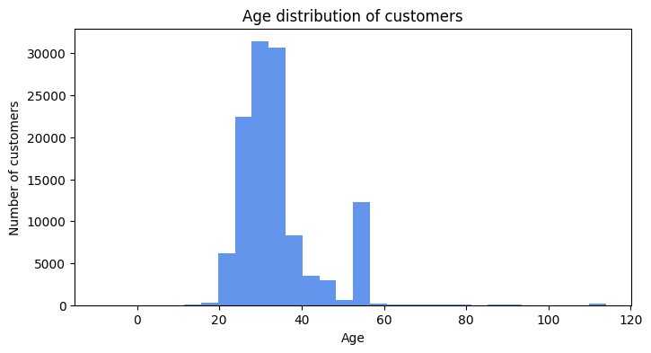

```python
# Phân bổ độ tuổi theo nhóm giới tính :
plt.figure(figsize=(8,4))

## data
male_age = df_cus[df_cus['usergender'] == 'Male']['age']
female_age = df_cus[df_cus['usergender'] == 'Female']['age']
unknown_age = df_cus[df_cus['usergender'] == 'Not verify']['age']

## plot
plt.hist(male_age, bins=30, alpha = 0.3, color = 'cornflowerblue', label = 'Male')
plt.hist(female_age, bins=30, alpha = 0.3, color = 'salmon', label = 'Female')
plt.hist(unknown_age, bins=30, alpha = 0.3, color = 'limegreen', label = 'Not verify')

##edit
plt.title('Age distribution')
plt.xlabel('ages')
plt.ylabel('#customers')
plt.legend()
plt.show()
```

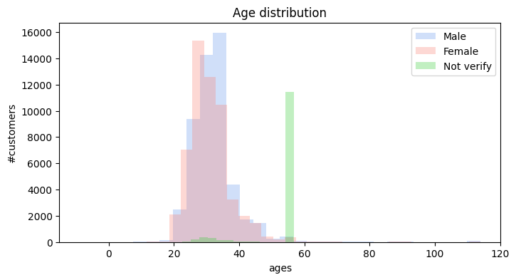

```python
# Đánh giá chi tiết nhóm Not Verify
df_gen = df_cus.groupby('usergender').agg(total=('customer_id','count')).sort_values(by='total', ascending=False).reset_index()
df_gen
```

<table border="1" class="dataframe">
  <thead>
    <tr style="text-align: right;">
      <th></th>
      <th>usergender</th>
      <th>total</th>
    </tr>
  </thead>
  <tbody>
    <tr>
      <th>0</th>
      <td>Female</td>
      <td>55689</td>
    </tr>
    <tr>
      <th>1</th>
      <td>Male</td>
      <td>50873</td>
    </tr>
    <tr>
      <th>2</th>
      <td>Not verify</td>
      <td>12915</td>
    </tr>
  </tbody>
</table>

```python
# Visualize
plt.pie(df_gen['total'], labels=df_gen['usergender'], autopct='%1.1f%%', colors=['cornflowerblue','lightsteelblue','slategrey'],startangle=90)
plt.title('Gender distribution')
plt.show()
```

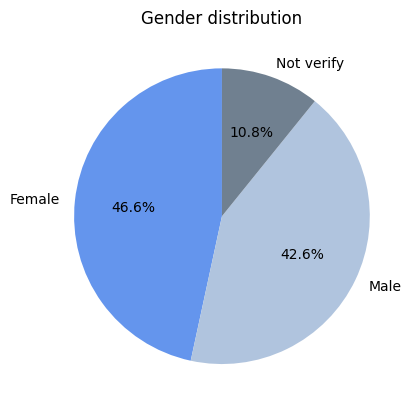

```python
df_cus[df_cus['usergender']=='Not verify'].groupby('age').agg(number=('customer_id','count')).sort_values(by='number',ascending=False).reset_index().head(10)
```

<table border="1" class="dataframe">
  <thead>
    <tr style="text-align: right;">
      <th></th>
      <th>age</th>
      <th>number</th>
    </tr>
  </thead>
  <tbody>
    <tr>
      <th>0</th>
      <td>56</td>
      <td>11435</td>
    </tr>
    <tr>
      <th>1</th>
      <td>30</td>
      <td>126</td>
    </tr>
    <tr>
      <th>2</th>
      <td>31</td>
      <td>122</td>
    </tr>
    <tr>
      <th>3</th>
      <td>32</td>
      <td>114</td>
    </tr>
    <tr>
      <th>4</th>
      <td>28</td>
      <td>110</td>
    </tr>
    <tr>
      <th>5</th>
      <td>29</td>
      <td>107</td>
    </tr>
    <tr>
      <th>6</th>
      <td>27</td>
      <td>101</td>
    </tr>
    <tr>
      <th>7</th>
      <td>33</td>
      <td>101</td>
    </tr>
    <tr>
      <th>8</th>
      <td>26</td>
      <td>96</td>
    </tr>
    <tr>
      <th>9</th>
      <td>34</td>
      <td>95</td>
    </tr>
  </tbody>
</table>

>**Notes**
>- Nhóm khách hàng chưa verify tài khoản chiếm 10.8%, dẫn đến 2 trường hợp:
>>- Nếu họ nhập dob thì sẽ có data
>>- Nếu họ không nhập dob thì hệ thống sẽ auto fill là 1970 --> 54 tuổi


###**Age generation distribution**

```python
df_cus.head(2)
```

<table border="1" class="dataframe">
  <thead>
    <tr style="text-align: right;">
      <th></th>
      <th>customer_id</th>
      <th>dob</th>
      <th>usergender</th>
      <th>age</th>
    </tr>
  </thead>
  <tbody>
    <tr>
      <th>0</th>
      <td>100009</td>
      <td>1989-02-25</td>
      <td>Male</td>
      <td>37</td>
    </tr>
    <tr>
      <th>1</th>
      <td>100493</td>
      <td>1991-06-09</td>
      <td>Male</td>
      <td>34</td>
    </tr>
  </tbody>
</table>

```python
# Logic phân loại X, Y, Z, Baby --> Dựa vào năm sinh
df_cus['age_generation'] = df_cus['dob'].apply(lambda x: 'Baby Boomer' if x.year <= 1964 else ('Gen X' if x.year <= 1980 else ('Gen Y' if x.year <= 1996 else 'Gen Z')))
```

```python
df_gen_group = df_cus[df_cus['usergender']!='Not verify'].groupby('age_generation').agg(total=('customer_id','count')).sort_values(by='total',ascending = False).reset_index()
df_gen_group
```

<table border="1" class="dataframe">
  <thead>
    <tr style="text-align: right;">
      <th></th>
      <th>age_generation</th>
      <th>total</th>
    </tr>
  </thead>
  <tbody>
    <tr>
      <th>0</th>
      <td>Gen Y</td>
      <td>63310</td>
    </tr>
    <tr>
      <th>1</th>
      <td>Gen Z</td>
      <td>38401</td>
    </tr>
    <tr>
      <th>2</th>
      <td>Gen X</td>
      <td>4261</td>
    </tr>
    <tr>
      <th>3</th>
      <td>Baby Boomer</td>
      <td>590</td>
    </tr>
  </tbody>
</table>

```python
# Kết hợp 2 biểu đồ
plt.figure(figsize=(13, 4))

# plot 1
ax1 = plt.subplot(1,2,1)
df_cus[df_cus['usergender']!='Not verify']['age'].hist(bins=30,color='cornflowerblue', grid = False)
plt.xlabel('Age')
plt.ylabel('customers')
plt.title('Age distribution')

ax2 = plt.subplot(1,2,2)
plt.pie(df_gen_group['total'], labels=df_gen_group['age_generation'], autopct='%1.1f%%', colors=['cornflowerblue','lightsteelblue','slategrey','salmon'],startangle=90)
plt.title('Age generation distribution')

plt.show()

```

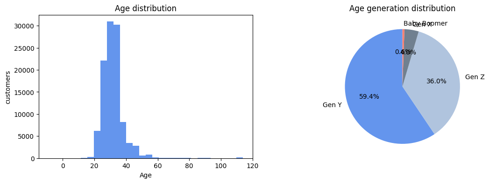

##**3.2 Time series data - When dis customers buy tickets ?**

###**Trend by month**

```python
df_join_all['month'] = pd.to_datetime(df_join_all['time']).dt.month
df_join_all['day_name'] = pd.to_datetime(df_join_all['time']).dt.day_name()
df_join_all['hour'] = pd.to_datetime(df_join_all['time']).dt.hour
df_join_all['year_month'] = pd.to_datetime(df_join_all['time']).dt.strftime('%Y-%m')
```

```python
df_join_all.head(2)
```

<table border="1" class="dataframe">
  <thead>
    <tr style="text-align: right;">
      <th></th>
      <th>ticket_id</th>
      <th>customer_id</th>
      <th>paying_method</th>
      <th>theater_name</th>
      <th>device_number</th>
      <th>original_price</th>
      <th>discount_value</th>
      <th>final_price</th>
      <th>time</th>
      <th>status_id</th>
      <th>campaign_id</th>
      <th>movie_name</th>
      <th>campaign_type</th>
      <th>usergender</th>
      <th>dob</th>
      <th>model</th>
      <th>platform</th>
      <th>description</th>
      <th>error_group</th>
      <th>age_days</th>
      <th>age</th>
      <th>month</th>
      <th>day_name</th>
      <th>hour</th>
      <th>year_month</th>
    </tr>
  </thead>
  <tbody>
    <tr>
      <th>0</th>
      <td>4f5200dcdcf2396b8d50ff84bf423f32</td>
      <td>100009</td>
      <td>money in app</td>
      <td>13.0</td>
      <td>244764a57dbdeb8fe9b164847ad55183</td>
      <td>9.90</td>
      <td>2.10</td>
      <td>7.80</td>
      <td>2022-07-08 17:46:36.145</td>
      <td>1</td>
      <td>83330</td>
      <td>Thor: Love And Thunder</td>
      <td>direct discount</td>
      <td>Male</td>
      <td>1989-02-25</td>
      <td>iPhone13,1</td>
      <td>mobile</td>
      <td>Order successful</td>
      <td>unknown</td>
      <td>13608</td>
      <td>37</td>
      <td>7</td>
      <td>Friday</td>
      <td>17</td>
      <td>2022-07</td>
    </tr>
    <tr>
      <th>1</th>
      <td>07abbaf28c772692f0367ad992bb3184</td>
      <td>100493</td>
      <td>bank account</td>
      <td>180.0</td>
      <td>8fa83cf46284aafd6e5da6c96f7862b5</td>
      <td>8.66</td>
      <td>1.48</td>
      <td>7.18</td>
      <td>2022-07-15 20:44:09.952</td>
      <td>1</td>
      <td>83330</td>
      <td>Thor: Love And Thunder</td>
      <td>direct discount</td>
      <td>Male</td>
      <td>1991-06-09</td>
      <td>browser</td>
      <td>website</td>
      <td>Order successful</td>
      <td>unknown</td>
      <td>12774</td>
      <td>34</td>
      <td>7</td>
      <td>Friday</td>
      <td>20</td>
      <td>2022-07</td>
    </tr>
  </tbody>
</table>

```python
# Thống kê theo tháng
df_time_month = df_join_all.groupby('year_month').agg(
    total_tickets=('ticket_id','count'),
).reset_index()
```

```python
df_time_month.head()
```

<table border="1" class="dataframe">
  <thead>
    <tr style="text-align: right;">
      <th></th>
      <th>year_month</th>
      <th>total_tickets</th>
    </tr>
  </thead>
  <tbody>
    <tr>
      <th>0</th>
      <td>2019-01</td>
      <td>2019</td>
    </tr>
    <tr>
      <th>1</th>
      <td>2019-02</td>
      <td>1626</td>
    </tr>
    <tr>
      <th>2</th>
      <td>2019-03</td>
      <td>1004</td>
    </tr>
    <tr>
      <th>3</th>
      <td>2019-04</td>
      <td>4069</td>
    </tr>
    <tr>
      <th>4</th>
      <td>2019-05</td>
      <td>4430</td>
    </tr>
  </tbody>
</table>

```python
# Vẽ biểu đồ miền theo tháng

plt.figure(figsize=(13, 4))
plt.fill_between(df_time_month['year_month'], df_time_month['total_tickets'], alpha=0.7 , color='cornflowerblue')
plt.xticks(rotation=90)
plt.xlabel('Month')
plt.ylabel('Total tickets')
plt.title('Trend by month')
plt.show()
```

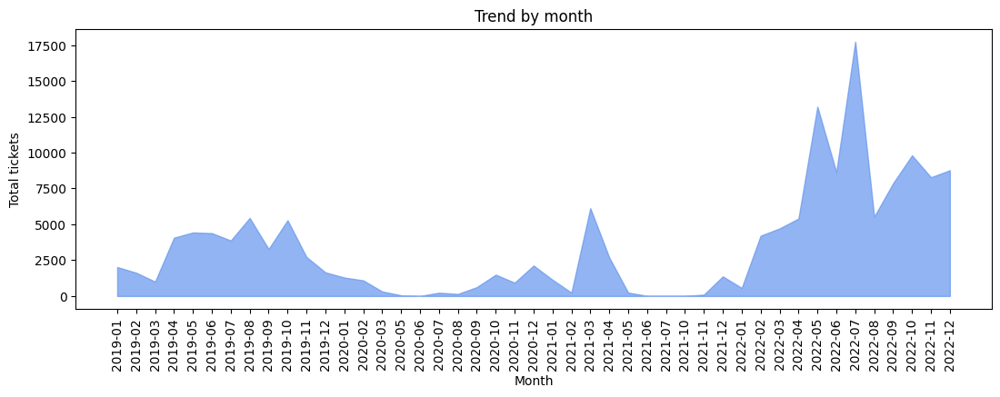

```python
## Giai đoạn covid diễn ra --> khách hàng không đi xem phim ( Không có một số tháng )
# --> Cần 1 bảng DIM thời gian theo tháng (FULL)
```

```python
# Tạo bảng dimension thời gian:

# Xác định khoảng thời gian
start_date = '2019-01-01'
end_date = '2022-12-31'

# Tạo ra range thời gian từ 2 mốc start và end
date_range = pd.date_range(start=start_date, end=end_date, freq='MS')

# Lấy ra list phần tử thời gian tương ứng:
list_month = date_range.month
list_month_name = date_range.strftime('%B')
list_year = date_range.year
list_year_month = date_range.strftime('%Y-%m')

# # Khởi tạo dataframe
dim_time = pd.DataFrame({
    'month_number': list_month,
    'month_name': list_month_name,
    'year': list_year,
    'year_month': list_year_month
})

```

```python
# Join với bảng join_all để có đủ data thời gian
df_time_month_dim = pd.merge(dim_time, df_time_month, how = 'left', on='year_month')
```

```python
# Vẽ biểu đồ miền
plt.figure(figsize=(13, 4))
plt.fill_between(df_time_month_dim['year_month'], df_time_month_dim['total_tickets'], alpha=0.7 , color='cornflowerblue')
plt.xticks(rotation=90)
plt.xlabel('Month')
plt.ylabel('Total tickets')
plt.title('Trend by month')
plt.show()
```

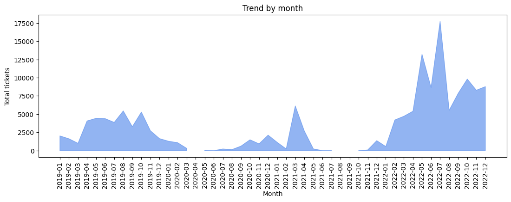

###**Trend by weekdays**

```python
# Thống kê theo ngày trong tuần
df_time_days = df_join_all.groupby('day_name').agg(
    total_tickets=('ticket_id','count'),
).reset_index()
```

```python
df_time_days
```

<table border="1" class="dataframe">
  <thead>
    <tr style="text-align: right;">
      <th></th>
      <th>day_name</th>
      <th>total_tickets</th>
    </tr>
  </thead>
  <tbody>
    <tr>
      <th>0</th>
      <td>Friday</td>
      <td>26438</td>
    </tr>
    <tr>
      <th>1</th>
      <td>Monday</td>
      <td>16702</td>
    </tr>
    <tr>
      <th>2</th>
      <td>Saturday</td>
      <td>34450</td>
    </tr>
    <tr>
      <th>3</th>
      <td>Sunday</td>
      <td>26960</td>
    </tr>
    <tr>
      <th>4</th>
      <td>Thursday</td>
      <td>19101</td>
    </tr>
    <tr>
      <th>5</th>
      <td>Tuesday</td>
      <td>14793</td>
    </tr>
    <tr>
      <th>6</th>
      <td>Wednesday</td>
      <td>16281</td>
    </tr>
  </tbody>
</table>

```python
# Định nghĩa lại thứ tự các ngày trong tuần
week_order = ['Monday','Tuesday','Wednesday','Thursday','Friday','Saturday','Sunday']
# Sắp xếp theo thứ tự các ngày trong tuần
df_time_days['day_name'] = pd.Categorical(df_time_days['day_name'], categories=week_order, ordered=True)
df_time_days = df_time_days.sort_values('day_name')
# Vẽ biểu đồ miền
plt.figure(figsize=(13, 4))
plt.fill_between(df_time_days['day_name'], df_time_days['total_tickets'], alpha=0.7 , color='cornflowerblue')
plt.xticks(rotation=90)
plt.show()
```

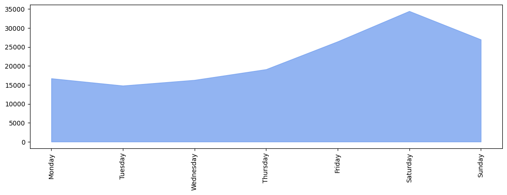

### **Trend by hours**

```python
# Thống kê theo giờ
df_time_hours = df_join_all.groupby('hour').agg(
    total_tickets=('ticket_id','count'),
).reset_index()
```

```python
# Vẽ biểu đồ miền cho hour
plt.figure(figsize=(13, 4))
plt.fill_between(df_time_hours['hour'], df_time_hours['total_tickets'], alpha=0.8 , color='cornflowerblue')
x_values = [i for i in range(24)]
plt.xticks(x_values)
plt.xlabel('Hour')
plt.ylabel('Total tickets')
plt.title('Trend by hours')
plt.show()
```

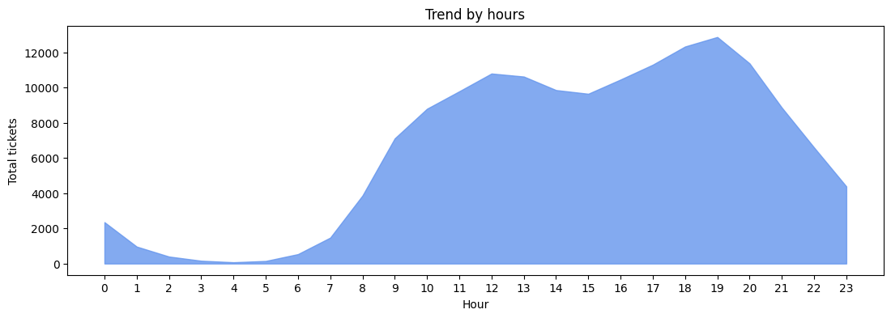

##**3.3 Factors related to the customer's purchasing**

###**Payment platform**

```python
df_join_all.head(2)
```

<table border="1" class="dataframe">
  <thead>
    <tr style="text-align: right;">
      <th></th>
      <th>ticket_id</th>
      <th>customer_id</th>
      <th>paying_method</th>
      <th>theater_name</th>
      <th>device_number</th>
      <th>original_price</th>
      <th>discount_value</th>
      <th>final_price</th>
      <th>time</th>
      <th>status_id</th>
      <th>campaign_id</th>
      <th>movie_name</th>
      <th>campaign_type</th>
      <th>usergender</th>
      <th>dob</th>
      <th>model</th>
      <th>platform</th>
      <th>description</th>
      <th>error_group</th>
      <th>age_days</th>
      <th>age</th>
      <th>month</th>
      <th>day_name</th>
      <th>hour</th>
      <th>year_month</th>
    </tr>
  </thead>
  <tbody>
    <tr>
      <th>0</th>
      <td>4f5200dcdcf2396b8d50ff84bf423f32</td>
      <td>100009</td>
      <td>money in app</td>
      <td>13.0</td>
      <td>244764a57dbdeb8fe9b164847ad55183</td>
      <td>9.90</td>
      <td>2.10</td>
      <td>7.80</td>
      <td>2022-07-08 17:46:36.145</td>
      <td>1</td>
      <td>83330</td>
      <td>Thor: Love And Thunder</td>
      <td>direct discount</td>
      <td>Male</td>
      <td>1989-02-25</td>
      <td>iPhone13,1</td>
      <td>mobile</td>
      <td>Order successful</td>
      <td>unknown</td>
      <td>13608</td>
      <td>37</td>
      <td>7</td>
      <td>Friday</td>
      <td>17</td>
      <td>2022-07</td>
    </tr>
    <tr>
      <th>1</th>
      <td>07abbaf28c772692f0367ad992bb3184</td>
      <td>100493</td>
      <td>bank account</td>
      <td>180.0</td>
      <td>8fa83cf46284aafd6e5da6c96f7862b5</td>
      <td>8.66</td>
      <td>1.48</td>
      <td>7.18</td>
      <td>2022-07-15 20:44:09.952</td>
      <td>1</td>
      <td>83330</td>
      <td>Thor: Love And Thunder</td>
      <td>direct discount</td>
      <td>Male</td>
      <td>1991-06-09</td>
      <td>browser</td>
      <td>website</td>
      <td>Order successful</td>
      <td>unknown</td>
      <td>12774</td>
      <td>34</td>
      <td>7</td>
      <td>Friday</td>
      <td>20</td>
      <td>2022-07</td>
    </tr>
  </tbody>
</table>

```python
df_platform = df_join_all[df_join_all['platform']!='unknown'].groupby('platform').agg(
    total_tickets=('ticket_id','count')
).reset_index()
```

```python
df_platform
```

<table border="1" class="dataframe">
  <thead>
    <tr style="text-align: right;">
      <th></th>
      <th>platform</th>
      <th>total_tickets</th>
    </tr>
  </thead>
  <tbody>
    <tr>
      <th>0</th>
      <td>mobile</td>
      <td>138136</td>
    </tr>
    <tr>
      <th>1</th>
      <td>website</td>
      <td>16511</td>
    </tr>
  </tbody>
</table>

```python
# Biểu đồ cột ngang
plt.figure(figsize=(10, 4))
plt.barh(
    df_platform['platform'], df_platform['total_tickets'],
    color = df_platform['platform'].replace({ 'mobile': 'lightskyblue',  'website': 'tomato'})
)
for index,value in enumerate(df_platform['total_tickets']):
    plt.text(value,index,str(value))

plt.title('#ticket by platform')
```

```console
Text(0.5, 1.0, '#ticket by platform')
```

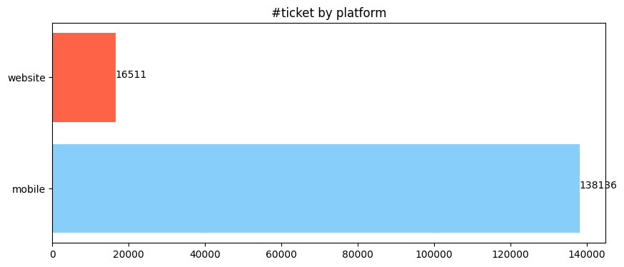

```python
plt.figure(figsize=(6, 4))
plt.pie(df_platform['total_tickets'], labels=df_platform['platform'], autopct='%1.1f%%', colors=['lightskyblue','tomato'],startangle=90)
plt.title('Platform distribution')
plt.show()
```

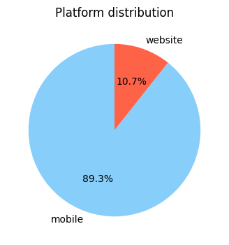

```python
# Biểu đồ thời gian
df_platform_time = df_join_all[df_join_all['platform']!='unknown'].groupby(['year_month','platform']).agg(
    total_tickets=('ticket_id','count')
).sort_values(by='year_month').reset_index()
```

```python
df_platform_time.head(10)
```

<table border="1" class="dataframe">
  <thead>
    <tr style="text-align: right;">
      <th></th>
      <th>year_month</th>
      <th>platform</th>
      <th>total_tickets</th>
    </tr>
  </thead>
  <tbody>
    <tr>
      <th>0</th>
      <td>2019-01</td>
      <td>mobile</td>
      <td>2019</td>
    </tr>
    <tr>
      <th>1</th>
      <td>2019-02</td>
      <td>mobile</td>
      <td>1626</td>
    </tr>
    <tr>
      <th>2</th>
      <td>2019-03</td>
      <td>mobile</td>
      <td>1004</td>
    </tr>
    <tr>
      <th>3</th>
      <td>2019-04</td>
      <td>mobile</td>
      <td>4069</td>
    </tr>
    <tr>
      <th>4</th>
      <td>2019-05</td>
      <td>mobile</td>
      <td>4430</td>
    </tr>
    <tr>
      <th>5</th>
      <td>2019-06</td>
      <td>mobile</td>
      <td>4387</td>
    </tr>
    <tr>
      <th>6</th>
      <td>2019-07</td>
      <td>mobile</td>
      <td>3872</td>
    </tr>
    <tr>
      <th>7</th>
      <td>2019-08</td>
      <td>mobile</td>
      <td>5444</td>
    </tr>
    <tr>
      <th>8</th>
      <td>2019-09</td>
      <td>mobile</td>
      <td>3278</td>
    </tr>
    <tr>
      <th>9</th>
      <td>2019-10</td>
      <td>mobile</td>
      <td>5284</td>
    </tr>
  </tbody>
</table>

```python
# vẽ biểu đồ line chart:
plt.figure(figsize=(13, 4))

df_mobile_line = df_platform_time[df_platform_time['platform']=='mobile']
plt.plot(df_mobile_line['year_month'], df_mobile_line['total_tickets'], label='mobile', marker = 'o' ,  color='lightskyblue', linewidth = 2 , markersize = 4)

df_website_line = df_platform_time[df_platform_time['platform']=='website']
plt.plot(df_website_line['year_month'], df_website_line['total_tickets'], label='website', marker = 'o' ,  color='tomato', linewidth = 2 , markersize = 4)

plt.legend()
plt.xticks(rotation=90)
plt.show()
```

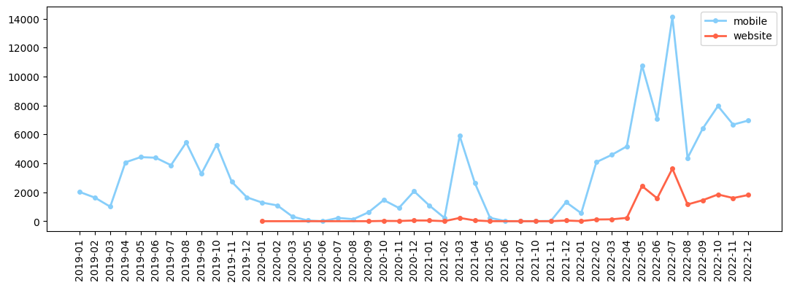

### OS version

```python
df_join_all.head(2)
```

<table border="1" class="dataframe">
  <thead>
    <tr style="text-align: right;">
      <th></th>
      <th>ticket_id</th>
      <th>customer_id</th>
      <th>paying_method</th>
      <th>theater_name</th>
      <th>device_number</th>
      <th>original_price</th>
      <th>discount_value</th>
      <th>final_price</th>
      <th>time</th>
      <th>status_id</th>
      <th>campaign_id</th>
      <th>movie_name</th>
      <th>campaign_type</th>
      <th>usergender</th>
      <th>dob</th>
      <th>model</th>
      <th>platform</th>
      <th>description</th>
      <th>error_group</th>
      <th>age_days</th>
      <th>age</th>
      <th>month</th>
      <th>day_name</th>
      <th>hour</th>
      <th>year_month</th>
    </tr>
  </thead>
  <tbody>
    <tr>
      <th>0</th>
      <td>4f5200dcdcf2396b8d50ff84bf423f32</td>
      <td>100009</td>
      <td>money in app</td>
      <td>13.0</td>
      <td>244764a57dbdeb8fe9b164847ad55183</td>
      <td>9.90</td>
      <td>2.10</td>
      <td>7.80</td>
      <td>2022-07-08 17:46:36.145</td>
      <td>1</td>
      <td>83330</td>
      <td>Thor: Love And Thunder</td>
      <td>direct discount</td>
      <td>Male</td>
      <td>1989-02-25</td>
      <td>iPhone13,1</td>
      <td>mobile</td>
      <td>Order successful</td>
      <td>unknown</td>
      <td>13608</td>
      <td>37</td>
      <td>7</td>
      <td>Friday</td>
      <td>17</td>
      <td>2022-07</td>
    </tr>
    <tr>
      <th>1</th>
      <td>07abbaf28c772692f0367ad992bb3184</td>
      <td>100493</td>
      <td>bank account</td>
      <td>180.0</td>
      <td>8fa83cf46284aafd6e5da6c96f7862b5</td>
      <td>8.66</td>
      <td>1.48</td>
      <td>7.18</td>
      <td>2022-07-15 20:44:09.952</td>
      <td>1</td>
      <td>83330</td>
      <td>Thor: Love And Thunder</td>
      <td>direct discount</td>
      <td>Male</td>
      <td>1991-06-09</td>
      <td>browser</td>
      <td>website</td>
      <td>Order successful</td>
      <td>unknown</td>
      <td>12774</td>
      <td>34</td>
      <td>7</td>
      <td>Friday</td>
      <td>20</td>
      <td>2022-07</td>
    </tr>
  </tbody>
</table>

```python
# phân loại thiết bị OS thành các nhóm: android, ios, unknown, browser
df_join_all['os_version'] = df_join_all['model'].apply(lambda x: 'ios' if ('iPhone' in x or 'iPod' in x )
                                                        else 'browser' if x == 'browser'
                                                       else 'unknown' if ( 'devicemodel' in x or 'unknown' in x )
                                                       else 'android & other')
```

```python
df_join_all['os_version'].unique()
```

```console
array(['ios', 'browser', 'unknown', 'android & other'], dtype=object)
```

```python
# Group by để thống kê
df_os = df_join_all.groupby('os_version').agg(
    total_tickets=('ticket_id','count')).sort_values(by='total_tickets',ascending=True).reset_index()
```

```python
df_os
```

<table border="1" class="dataframe">
  <thead>
    <tr style="text-align: right;">
      <th></th>
      <th>os_version</th>
      <th>total_tickets</th>
    </tr>
  </thead>
  <tbody>
    <tr>
      <th>0</th>
      <td>browser</td>
      <td>13377</td>
    </tr>
    <tr>
      <th>1</th>
      <td>android &amp; other</td>
      <td>21092</td>
    </tr>
    <tr>
      <th>2</th>
      <td>ios</td>
      <td>51402</td>
    </tr>
    <tr>
      <th>3</th>
      <td>unknown</td>
      <td>68854</td>
    </tr>
  </tbody>
</table>

```python
# Biểu đồ cột ngang :
plt.figure(figsize=(12, 3))

ax1 = plt.subplot(1,2,1)
plt.barh(
    df_os['os_version'], df_os['total_tickets'],
    color = df_os['os_version'].replace({ 'browser': 'lightsteelblue',  'android & other': 'lightskyblue', 'ios': 'cornflowerblue', 'unknown': 'steelblue'})
)

for index,value in enumerate(df_os['total_tickets']):
    plt.text(value,index,str(value))
plt.title('#ticket by os')

ax2 = plt.subplot(1,2,2)
plt.pie(df_os['total_tickets'], labels= df_os['os_version'],
        colors=df_os['os_version'].replace({ 'browser': 'lightsteelblue',  'android & other': 'lightskyblue', 'ios': 'cornflowerblue', 'unknown': 'steelblue'}),
        autopct='%1.0f%%',
        startangle=90)
plt.show()
```

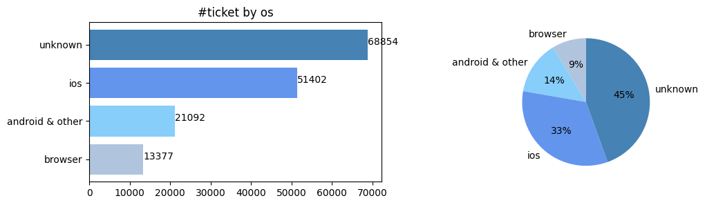

```python
# Biểu đồ thời gian
df_os_time = df_join_all.groupby(['year_month','os_version']).agg(
    total_tickets=('ticket_id','count')
).sort_values(by='year_month', ascending=True).reset_index()
```

```python
df_os_time.head(10)
```

<table border="1" class="dataframe">
  <thead>
    <tr style="text-align: right;">
      <th></th>
      <th>year_month</th>
      <th>os_version</th>
      <th>total_tickets</th>
    </tr>
  </thead>
  <tbody>
    <tr>
      <th>0</th>
      <td>2019-01</td>
      <td>android &amp; other</td>
      <td>713</td>
    </tr>
    <tr>
      <th>1</th>
      <td>2019-01</td>
      <td>ios</td>
      <td>1233</td>
    </tr>
    <tr>
      <th>2</th>
      <td>2019-01</td>
      <td>unknown</td>
      <td>73</td>
    </tr>
    <tr>
      <th>3</th>
      <td>2019-02</td>
      <td>android &amp; other</td>
      <td>542</td>
    </tr>
    <tr>
      <th>4</th>
      <td>2019-02</td>
      <td>ios</td>
      <td>1074</td>
    </tr>
    <tr>
      <th>5</th>
      <td>2019-02</td>
      <td>unknown</td>
      <td>10</td>
    </tr>
    <tr>
      <th>6</th>
      <td>2019-03</td>
      <td>android &amp; other</td>
      <td>371</td>
    </tr>
    <tr>
      <th>7</th>
      <td>2019-03</td>
      <td>ios</td>
      <td>631</td>
    </tr>
    <tr>
      <th>8</th>
      <td>2019-03</td>
      <td>unknown</td>
      <td>2</td>
    </tr>
    <tr>
      <th>9</th>
      <td>2019-04</td>
      <td>android &amp; other</td>
      <td>1519</td>
    </tr>
  </tbody>
</table>

```python
# Xử lí data dạng PIVOT để vẽ biểu đồ miền

df_os_time = (df_join_all.pivot_table(index='year_month', columns='os_version', aggfunc='count', values='ticket_id').reset_index())
```

```python
df_os_time.head(10)
```

<table border="1" class="dataframe">
  <thead>
    <tr style="text-align: right;">
      <th>os_version</th>
      <th>year_month</th>
      <th>android &amp; other</th>
      <th>browser</th>
      <th>ios</th>
      <th>unknown</th>
    </tr>
  </thead>
  <tbody>
    <tr>
      <th>0</th>
      <td>2019-01</td>
      <td>713.0</td>
      <td>NaN</td>
      <td>1233.0</td>
      <td>73.0</td>
    </tr>
    <tr>
      <th>1</th>
      <td>2019-02</td>
      <td>542.0</td>
      <td>NaN</td>
      <td>1074.0</td>
      <td>10.0</td>
    </tr>
    <tr>
      <th>2</th>
      <td>2019-03</td>
      <td>371.0</td>
      <td>NaN</td>
      <td>631.0</td>
      <td>2.0</td>
    </tr>
    <tr>
      <th>3</th>
      <td>2019-04</td>
      <td>1519.0</td>
      <td>NaN</td>
      <td>2541.0</td>
      <td>9.0</td>
    </tr>
    <tr>
      <th>4</th>
      <td>2019-05</td>
      <td>1601.0</td>
      <td>NaN</td>
      <td>2826.0</td>
      <td>3.0</td>
    </tr>
    <tr>
      <th>5</th>
      <td>2019-06</td>
      <td>1575.0</td>
      <td>NaN</td>
      <td>2808.0</td>
      <td>4.0</td>
    </tr>
    <tr>
      <th>6</th>
      <td>2019-07</td>
      <td>1373.0</td>
      <td>NaN</td>
      <td>2499.0</td>
      <td>NaN</td>
    </tr>
    <tr>
      <th>7</th>
      <td>2019-08</td>
      <td>1797.0</td>
      <td>NaN</td>
      <td>3642.0</td>
      <td>5.0</td>
    </tr>
    <tr>
      <th>8</th>
      <td>2019-09</td>
      <td>1122.0</td>
      <td>NaN</td>
      <td>2151.0</td>
      <td>5.0</td>
    </tr>
    <tr>
      <th>9</th>
      <td>2019-10</td>
      <td>1964.0</td>
      <td>NaN</td>
      <td>3313.0</td>
      <td>7.0</td>
    </tr>
  </tbody>
</table>

```python
# vẽ biểu đồ miền theo thời gian

plt.figure(figsize=(13, 4))
plt.fill_between(df_os_time['year_month'], df_os_time['ios'], alpha=0.5 , color='cornflowerblue', label = 'ios')
plt.fill_between(df_os_time['year_month'], df_os_time['android & other'], alpha=0.5 , color='lightskyblue',label = 'android & other')
plt.fill_between(df_os_time['year_month'], df_os_time['browser'], alpha=0.5 , color='lightsteelblue',label = 'browser')
plt.fill_between(df_os_time['year_month'], df_os_time['unknown'], alpha=0.5 , color='steelblue',label = 'unknown')

# hiển thị biểu đồ
plt.title('ticket of os version by time')
#plt.xlabel('Month')
plt.ylabel('#ticket')
plt.legend(loc= 'upper left')
plt.xticks(rotation=90)
plt.show()
```

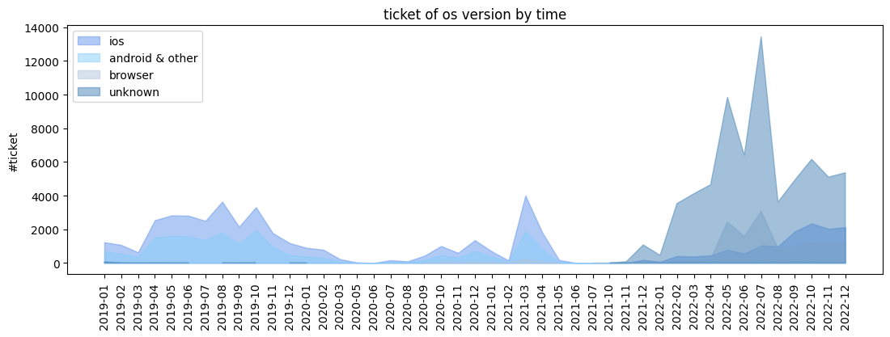

### Payment method

```python
df_join_all.head(2)
```

<table border="1" class="dataframe">
  <thead>
    <tr style="text-align: right;">
      <th></th>
      <th>ticket_id</th>
      <th>customer_id</th>
      <th>paying_method</th>
      <th>theater_name</th>
      <th>device_number</th>
      <th>original_price</th>
      <th>discount_value</th>
      <th>final_price</th>
      <th>time</th>
      <th>status_id</th>
      <th>campaign_id</th>
      <th>movie_name</th>
      <th>campaign_type</th>
      <th>usergender</th>
      <th>dob</th>
      <th>model</th>
      <th>platform</th>
      <th>description</th>
      <th>error_group</th>
      <th>age_days</th>
      <th>age</th>
      <th>month</th>
      <th>day_name</th>
      <th>hour</th>
      <th>year_month</th>
      <th>os_version</th>
    </tr>
  </thead>
  <tbody>
    <tr>
      <th>0</th>
      <td>4f5200dcdcf2396b8d50ff84bf423f32</td>
      <td>100009</td>
      <td>money in app</td>
      <td>13.0</td>
      <td>244764a57dbdeb8fe9b164847ad55183</td>
      <td>9.90</td>
      <td>2.10</td>
      <td>7.80</td>
      <td>2022-07-08 17:46:36.145</td>
      <td>1</td>
      <td>83330</td>
      <td>Thor: Love And Thunder</td>
      <td>direct discount</td>
      <td>Male</td>
      <td>1989-02-25</td>
      <td>iPhone13,1</td>
      <td>mobile</td>
      <td>Order successful</td>
      <td>unknown</td>
      <td>13608</td>
      <td>37</td>
      <td>7</td>
      <td>Friday</td>
      <td>17</td>
      <td>2022-07</td>
      <td>ios</td>
    </tr>
    <tr>
      <th>1</th>
      <td>07abbaf28c772692f0367ad992bb3184</td>
      <td>100493</td>
      <td>bank account</td>
      <td>180.0</td>
      <td>8fa83cf46284aafd6e5da6c96f7862b5</td>
      <td>8.66</td>
      <td>1.48</td>
      <td>7.18</td>
      <td>2022-07-15 20:44:09.952</td>
      <td>1</td>
      <td>83330</td>
      <td>Thor: Love And Thunder</td>
      <td>direct discount</td>
      <td>Male</td>
      <td>1991-06-09</td>
      <td>browser</td>
      <td>website</td>
      <td>Order successful</td>
      <td>unknown</td>
      <td>12774</td>
      <td>34</td>
      <td>7</td>
      <td>Friday</td>
      <td>20</td>
      <td>2022-07</td>
      <td>browser</td>
    </tr>
  </tbody>
</table>

```python
df_method = df_join_all[(df_join_all['status_id'] == 1 ) & (df_join_all['paying_method'] != 'other')].groupby('paying_method').agg(
    total_tickets=('ticket_id','count')
).sort_values(by='total_tickets', ascending=True).reset_index()
```

```python
# Xử lí data dạng PIVOT để vẽ biểu đồ miền

df_method_time = (df_join_all[(df_join_all['status_id'] == 1 ) & (df_join_all['paying_method'] != 'other')]
                  .pivot_table(index='year_month', columns='paying_method', aggfunc='count', values='ticket_id')
                  .reset_index())
```

```python
df_method_time.head(10)
```

<table border="1" class="dataframe">
  <thead>
    <tr style="text-align: right;">
      <th>paying_method</th>
      <th>year_month</th>
      <th>bank account</th>
      <th>credit card</th>
      <th>debit card</th>
      <th>money in app</th>
    </tr>
  </thead>
  <tbody>
    <tr>
      <th>0</th>
      <td>2019-01</td>
      <td>487.0</td>
      <td>336.0</td>
      <td>93.0</td>
      <td>443.0</td>
    </tr>
    <tr>
      <th>1</th>
      <td>2019-02</td>
      <td>484.0</td>
      <td>370.0</td>
      <td>93.0</td>
      <td>480.0</td>
    </tr>
    <tr>
      <th>2</th>
      <td>2019-03</td>
      <td>304.0</td>
      <td>225.0</td>
      <td>74.0</td>
      <td>263.0</td>
    </tr>
    <tr>
      <th>3</th>
      <td>2019-04</td>
      <td>1050.0</td>
      <td>705.0</td>
      <td>189.0</td>
      <td>1246.0</td>
    </tr>
    <tr>
      <th>4</th>
      <td>2019-05</td>
      <td>1092.0</td>
      <td>903.0</td>
      <td>212.0</td>
      <td>1410.0</td>
    </tr>
    <tr>
      <th>5</th>
      <td>2019-06</td>
      <td>1074.0</td>
      <td>962.0</td>
      <td>249.0</td>
      <td>1319.0</td>
    </tr>
    <tr>
      <th>6</th>
      <td>2019-07</td>
      <td>916.0</td>
      <td>782.0</td>
      <td>252.0</td>
      <td>1215.0</td>
    </tr>
    <tr>
      <th>7</th>
      <td>2019-08</td>
      <td>1367.0</td>
      <td>1142.0</td>
      <td>321.0</td>
      <td>1684.0</td>
    </tr>
    <tr>
      <th>8</th>
      <td>2019-09</td>
      <td>774.0</td>
      <td>711.0</td>
      <td>219.0</td>
      <td>1068.0</td>
    </tr>
    <tr>
      <th>9</th>
      <td>2019-10</td>
      <td>1280.0</td>
      <td>914.0</td>
      <td>309.0</td>
      <td>1833.0</td>
    </tr>
  </tbody>
</table>

```python
plt.figure(figsize=(12, 8))

ax1 = plt.subplot(2,2,1)
plt.barh(
    df_method['paying_method'], df_method['total_tickets'],
    color = df_method['paying_method'].replace({ 'bank account': 'lightsteelblue',  'credit card': 'lightskyblue', 'debit card': 'cornflowerblue', 'money in app': 'steelblue'})
)

for index,value in enumerate(df_method['total_tickets']):
    plt.text(value,index,str(value))
plt.title('#ticket by method')

ax2 = plt.subplot(2,2,2)
plt.pie(df_method['total_tickets'], labels= df_method['paying_method'],
        colors=df_method['paying_method'].replace({ 'bank account': 'lightsteelblue',  'credit card': 'lightskyblue', 'debit card': 'cornflowerblue', 'money in app': 'steelblue'}),
        autopct='%1.0f%%',
        startangle=90)

ax3 = plt.subplot(2,1,2)
plt.fill_between(df_method_time['year_month'], df_method_time['bank account'], color='cornflowerblue', alpha=0.5, label='bank account')
plt.fill_between(df_method_time['year_month'], df_method_time['credit card'], color='lightskyblue', alpha=0.5, label='credit card')
plt.fill_between(df_method_time['year_month'], df_method_time['debit card'], color='lightsteelblue', alpha=0.5, label='debit')
plt.fill_between(df_method_time['year_month'], df_method_time['money in app'], color='steelblue', alpha=0.5, label='money in app')

plt.title('#ticket of method by time')
# plt.xlabel('Month')
plt.ylabel('#ticket')
plt.legend(loc='upper left')
plt.xticks(rotation=90)
plt.show()

```

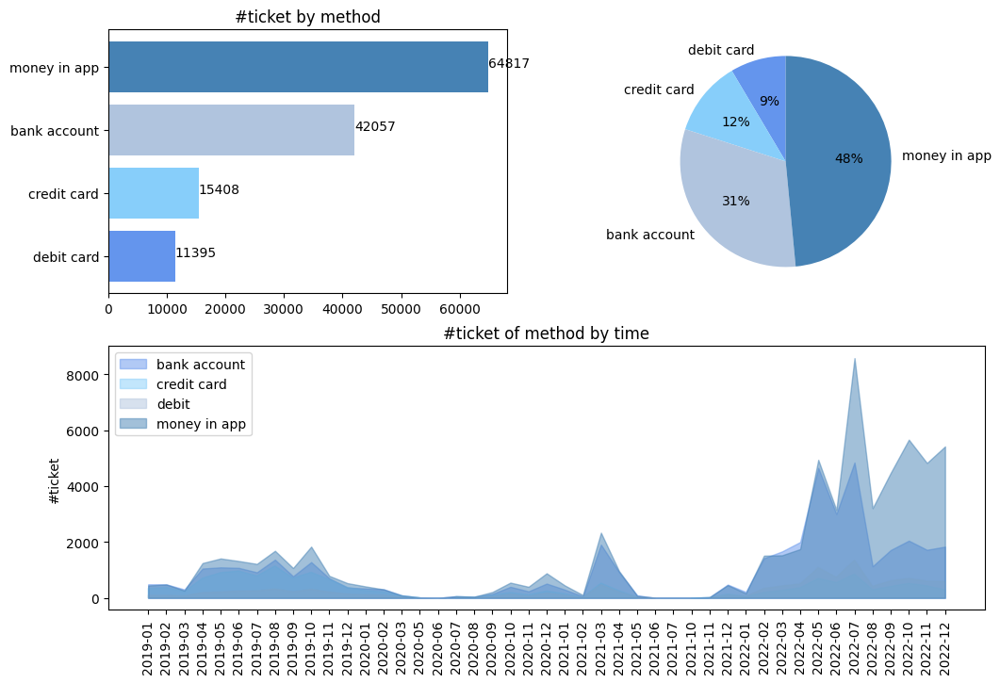

```python
# biểu đồ miền 100%
df_method_time = (df_join_all[(df_join_all['status_id'] == 1 ) & (df_join_all['paying_method'] != 'other')]
                  .pivot_table(index='year_month', columns='paying_method', aggfunc='count', values='ticket_id')
                  .reset_index())

df_method_time_pct = df_method_time.copy()
df_method_time_pct = df_method_time_pct.fillna(0)

df_method_time_pct['total'] = df_method_time_pct.iloc[:,1:].sum(axis=1)

for i in df_method_time_pct.columns[1:5]:
    df_method_time_pct[i+'_pct'] = df_method_time_pct[i] / df_method_time_pct['total']

df_method_time_pct.head(10)
```

<table border="1" class="dataframe">
  <thead>
    <tr style="text-align: right;">
      <th>paying_method</th>
      <th>year_month</th>
      <th>bank account</th>
      <th>credit card</th>
      <th>debit card</th>
      <th>money in app</th>
      <th>total</th>
      <th>bank account_pct</th>
      <th>credit card_pct</th>
      <th>debit card_pct</th>
      <th>money in app_pct</th>
    </tr>
  </thead>
  <tbody>
    <tr>
      <th>0</th>
      <td>2019-01</td>
      <td>487.0</td>
      <td>336.0</td>
      <td>93.0</td>
      <td>443.0</td>
      <td>1359.0</td>
      <td>0.358352</td>
      <td>0.247241</td>
      <td>0.068433</td>
      <td>0.325975</td>
    </tr>
    <tr>
      <th>1</th>
      <td>2019-02</td>
      <td>484.0</td>
      <td>370.0</td>
      <td>93.0</td>
      <td>480.0</td>
      <td>1427.0</td>
      <td>0.339173</td>
      <td>0.259285</td>
      <td>0.065172</td>
      <td>0.336370</td>
    </tr>
    <tr>
      <th>2</th>
      <td>2019-03</td>
      <td>304.0</td>
      <td>225.0</td>
      <td>74.0</td>
      <td>263.0</td>
      <td>866.0</td>
      <td>0.351039</td>
      <td>0.259815</td>
      <td>0.085450</td>
      <td>0.303695</td>
    </tr>
    <tr>
      <th>3</th>
      <td>2019-04</td>
      <td>1050.0</td>
      <td>705.0</td>
      <td>189.0</td>
      <td>1246.0</td>
      <td>3190.0</td>
      <td>0.329154</td>
      <td>0.221003</td>
      <td>0.059248</td>
      <td>0.390596</td>
    </tr>
    <tr>
      <th>4</th>
      <td>2019-05</td>
      <td>1092.0</td>
      <td>903.0</td>
      <td>212.0</td>
      <td>1410.0</td>
      <td>3617.0</td>
      <td>0.301908</td>
      <td>0.249654</td>
      <td>0.058612</td>
      <td>0.389826</td>
    </tr>
    <tr>
      <th>5</th>
      <td>2019-06</td>
      <td>1074.0</td>
      <td>962.0</td>
      <td>249.0</td>
      <td>1319.0</td>
      <td>3604.0</td>
      <td>0.298002</td>
      <td>0.266926</td>
      <td>0.069090</td>
      <td>0.365982</td>
    </tr>
    <tr>
      <th>6</th>
      <td>2019-07</td>
      <td>916.0</td>
      <td>782.0</td>
      <td>252.0</td>
      <td>1215.0</td>
      <td>3165.0</td>
      <td>0.289415</td>
      <td>0.247077</td>
      <td>0.079621</td>
      <td>0.383886</td>
    </tr>
    <tr>
      <th>7</th>
      <td>2019-08</td>
      <td>1367.0</td>
      <td>1142.0</td>
      <td>321.0</td>
      <td>1684.0</td>
      <td>4514.0</td>
      <td>0.302836</td>
      <td>0.252991</td>
      <td>0.071112</td>
      <td>0.373062</td>
    </tr>
    <tr>
      <th>8</th>
      <td>2019-09</td>
      <td>774.0</td>
      <td>711.0</td>
      <td>219.0</td>
      <td>1068.0</td>
      <td>2772.0</td>
      <td>0.279221</td>
      <td>0.256494</td>
      <td>0.079004</td>
      <td>0.385281</td>
    </tr>
    <tr>
      <th>9</th>
      <td>2019-10</td>
      <td>1280.0</td>
      <td>914.0</td>
      <td>309.0</td>
      <td>1833.0</td>
      <td>4336.0</td>
      <td>0.295203</td>
      <td>0.210793</td>
      <td>0.071264</td>
      <td>0.422740</td>
    </tr>
  </tbody>
</table>

```python
# vẽ biểu đồ miền 100%
plt.stackplot(df_method_time_pct['year_month'], df_method_time_pct["money in app_pct"],  df_method_time_pct['debit card_pct'], df_method_time_pct['credit card_pct'], df_method_time_pct['bank account_pct']
              , labels=['money in app', 'debit card', 'credit card', 'bank account'], colors=['royalblue', 'slategrey', 'lightsteelblue', 'cornflowerblue'], alpha=0.7)

plt.title('#ticket of method by time')
# plt.xlabel('Month')
plt.ylabel('#ticket')
plt.legend(loc='upper right', bbox_to_anchor=(1.15, 1))
plt.xticks(rotation=90)

plt.subplots_adjust(hspace = 0.7, top = 0.9)
```

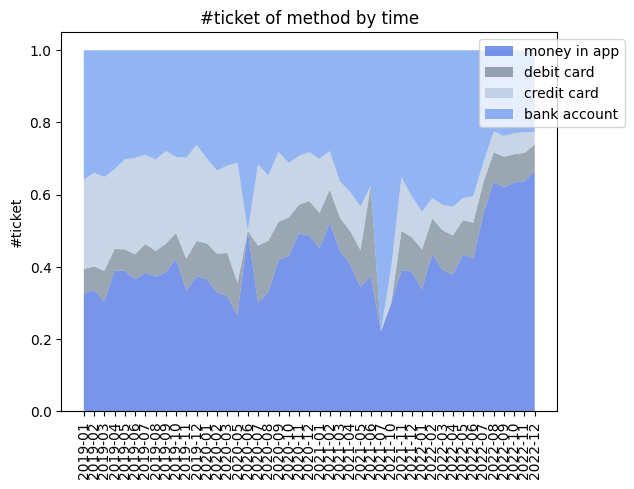

```python
# biểu diễn chung 1 frame
plt.figure(figsize=(12, 8))

ax1 = plt.subplot(3,2,1)
plt.barh(
    df_method['paying_method'], df_method['total_tickets'],
    color = df_method['paying_method'].replace({ 'bank account': 'lightsteelblue',  'credit card': 'lightskyblue', 'debit card': 'cornflowerblue', 'money in app': 'steelblue'})
)

for index,value in enumerate(df_method['total_tickets']):
    plt.text(value,index,str(value))
plt.title('#ticket by method')

ax2 = plt.subplot(3,2,2)
plt.pie(df_method['total_tickets'], labels= df_method['paying_method'],
        colors=df_method['paying_method'].replace({ 'bank account': 'lightsteelblue',  'credit card': 'lightskyblue', 'debit card': 'cornflowerblue', 'money in app': 'steelblue'}),
        autopct='%1.0f%%',
        startangle=90)

ax3 = plt.subplot(3,1,2)
plt.fill_between(df_method_time['year_month'], df_method_time['bank account'], color='cornflowerblue', alpha=0.5, label='bank account')
plt.fill_between(df_method_time['year_month'], df_method_time['credit card'], color='lightskyblue', alpha=0.5, label='credit card')
plt.fill_between(df_method_time['year_month'], df_method_time['debit card'], color='lightsteelblue', alpha=0.5, label='debit')
plt.fill_between(df_method_time['year_month'], df_method_time['money in app'], color='steelblue', alpha=0.5, label='money in app')

plt.title('#ticket of method by time')
# plt.xlabel('Month')
plt.ylabel('#ticket')
plt.legend(loc='upper left')
plt.xticks(rotation=90)

ax4 = plt.subplot(3,1,3)
# vẽ biểu đồ miền 100%
plt.stackplot(df_method_time_pct['year_month'], df_method_time_pct["money in app_pct"],  df_method_time_pct['debit card_pct'], df_method_time_pct['credit card_pct'], df_method_time_pct['bank account_pct']
              , labels=['money in app', 'debit card', 'credit card', 'bank account'], colors=['royalblue', 'slategrey', 'lightsteelblue', 'cornflowerblue'], alpha=0.7)

plt.title('#ticket of method by time')
# plt.xlabel('Month')
plt.ylabel('#ticket')
plt.legend(loc='upper right', bbox_to_anchor=(1.15, 1))
plt.xticks(rotation=90)

plt.subplots_adjust(hspace = 0.7, top = 0.9)
```

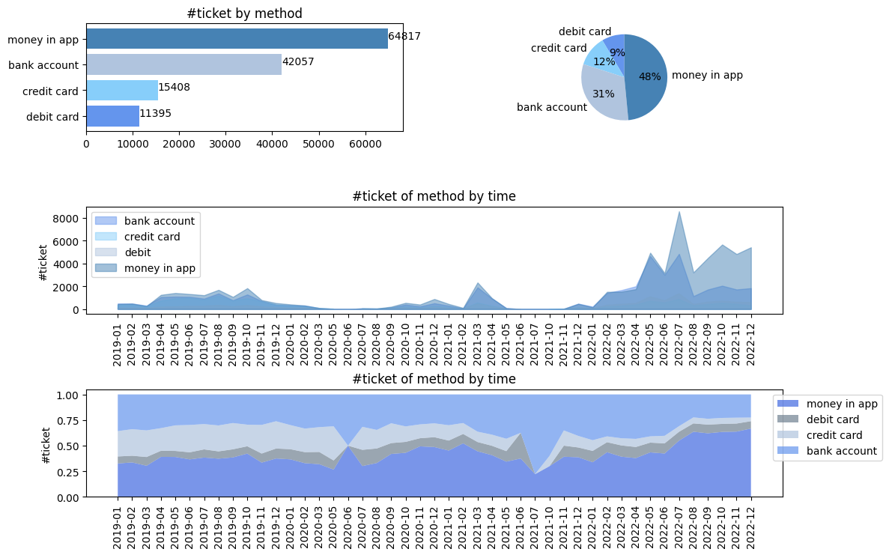

### Promotion

```python
df_join_all['campaign_type'].unique()
```

```console
array(['direct discount', 'unknown', 'voucher', 'reward point'],
      dtype=object)
```

```python
df_join_all['type'] = df_join_all['campaign_type'].apply(lambda x: 'non-promotion' if x == 'unknown' else 'promotion')
```

```python
df_type = df_join_all[(df_join_all['status_id'] == 1 ) & (df_join_all['paying_method'] != 'other')].groupby('type').agg(
    total_tickets=('ticket_id','count')
).sort_values(by='total_tickets', ascending=True).reset_index()
```

```python
df_type
```

<table border="1" class="dataframe">
  <thead>
    <tr style="text-align: right;">
      <th></th>
      <th>type</th>
      <th>total_tickets</th>
    </tr>
  </thead>
  <tbody>
    <tr>
      <th>0</th>
      <td>non-promotion</td>
      <td>55155</td>
    </tr>
    <tr>
      <th>1</th>
      <td>promotion</td>
      <td>78522</td>
    </tr>
  </tbody>
</table>

```python
# Xử lí data dạng PIVOT để vẽ biểu đồ miền

df_type_time = (df_join_all[(df_join_all['status_id'] == 1 ) & (df_join_all['paying_method'] != 'other')]
                  .pivot_table(index='year_month', columns='type', aggfunc='count', values='ticket_id')
                  .reset_index())

df_type_time_pct = df_type_time.copy()
df_type_time_pct = df_type_time_pct.fillna(0)

df_type_time_pct['total'] = df_type_time_pct.iloc[:,1:].sum(axis=1)

for i in df_type_time_pct.columns[1:3]:
    df_type_time_pct[i+'_pct'] = df_type_time_pct[i] / df_type_time_pct['total']

df_type_time_pct.head(10)
```

<table border="1" class="dataframe">
  <thead>
    <tr style="text-align: right;">
      <th>type</th>
      <th>year_month</th>
      <th>non-promotion</th>
      <th>promotion</th>
      <th>total</th>
      <th>non-promotion_pct</th>
      <th>promotion_pct</th>
    </tr>
  </thead>
  <tbody>
    <tr>
      <th>0</th>
      <td>2019-01</td>
      <td>517.0</td>
      <td>842.0</td>
      <td>1359.0</td>
      <td>0.380427</td>
      <td>0.619573</td>
    </tr>
    <tr>
      <th>1</th>
      <td>2019-02</td>
      <td>1335.0</td>
      <td>92.0</td>
      <td>1427.0</td>
      <td>0.935529</td>
      <td>0.064471</td>
    </tr>
    <tr>
      <th>2</th>
      <td>2019-03</td>
      <td>835.0</td>
      <td>31.0</td>
      <td>866.0</td>
      <td>0.964203</td>
      <td>0.035797</td>
    </tr>
    <tr>
      <th>3</th>
      <td>2019-04</td>
      <td>1699.0</td>
      <td>1491.0</td>
      <td>3190.0</td>
      <td>0.532602</td>
      <td>0.467398</td>
    </tr>
    <tr>
      <th>4</th>
      <td>2019-05</td>
      <td>1564.0</td>
      <td>2053.0</td>
      <td>3617.0</td>
      <td>0.432403</td>
      <td>0.567597</td>
    </tr>
    <tr>
      <th>5</th>
      <td>2019-06</td>
      <td>1391.0</td>
      <td>2213.0</td>
      <td>3604.0</td>
      <td>0.385960</td>
      <td>0.614040</td>
    </tr>
    <tr>
      <th>6</th>
      <td>2019-07</td>
      <td>1364.0</td>
      <td>1801.0</td>
      <td>3165.0</td>
      <td>0.430964</td>
      <td>0.569036</td>
    </tr>
    <tr>
      <th>7</th>
      <td>2019-08</td>
      <td>1556.0</td>
      <td>2958.0</td>
      <td>4514.0</td>
      <td>0.344705</td>
      <td>0.655295</td>
    </tr>
    <tr>
      <th>8</th>
      <td>2019-09</td>
      <td>922.0</td>
      <td>1850.0</td>
      <td>2772.0</td>
      <td>0.332612</td>
      <td>0.667388</td>
    </tr>
    <tr>
      <th>9</th>
      <td>2019-10</td>
      <td>1354.0</td>
      <td>2982.0</td>
      <td>4336.0</td>
      <td>0.312269</td>
      <td>0.687731</td>
    </tr>
  </tbody>
</table>

```python
# biểu diễn chung 1 frame
plt.figure(figsize=(12, 8))

ax1 = plt.subplot(3,2,1)
plt.barh(
    df_type['type'], df_type['total_tickets'],
    color = df_type['type'].replace({ 'non-promotion': 'lightskyblue',  'promotion': 'tomato'})
)

for index,value in enumerate(df_type['total_tickets']):
    plt.text(value,index,str(value))
plt.title('#ticket by type')

ax2 = plt.subplot(3,2,2)
plt.pie(df_type['total_tickets'], labels= df_type['type'],
        colors=df_type['type'].replace({'non-promotion': 'lightskyblue', 'promotion': 'tomato'}),
        autopct='%1.0f%%',
        startangle=90)

ax3 = plt.subplot(3,1,2)
plt.fill_between(df_type_time['year_month'], df_type_time['non-promotion'], color='lightskyblue', alpha=0.5, label='non-promotion')
plt.fill_between(df_type_time['year_month'], df_type_time['promotion'], color='tomato', alpha=0.5, label='promotion')

plt.title('#ticket of type by time')
# plt.xlabel('Month')
plt.ylabel('#ticket')
plt.legend(loc='upper left')
plt.xticks(rotation=90)

ax4 = plt.subplot(3,1,3)
# vẽ biểu đồ miền 100%
plt.stackplot(df_type_time_pct['year_month'], df_type_time_pct["non-promotion_pct"],  df_type_time_pct['promotion_pct']
              , labels=['non-promotion','promotion'], colors=['lightskyblue', 'tomato'], alpha=0.7)

plt.title('#ticket of type by time')
# plt.xlabel('Month')
plt.ylabel('#ticket')
plt.legend(loc='upper right', bbox_to_anchor=(1.15, 1))
plt.xticks(rotation=90)

plt.subplots_adjust(hspace = 0.7, top = 0.9)
```

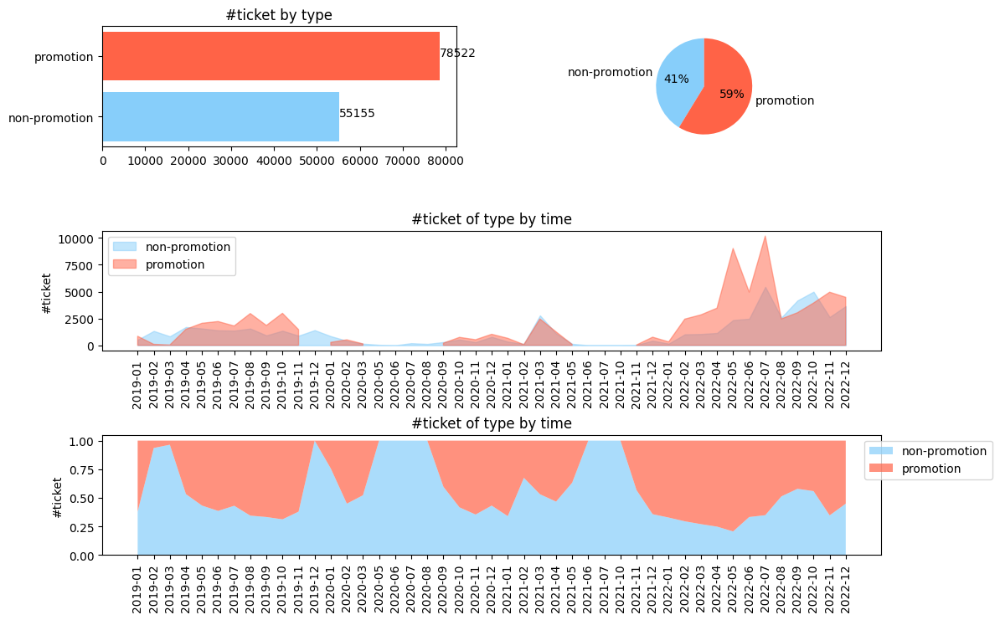

### Which movies they watched?

```python
df_film_sum = (
    df_join_all[df_join_all['status_id'] ==1]
    .groupby('movie_name')
    .agg(
        total_tickets=('ticket_id','count'),
        total_customer=('customer_id','nunique'),
        revenue=('final_price','sum')
    )
    .sort_values(by='total_tickets', ascending=False)
    .reset_index()
)
```

```python
df_film_sum.head(10)
```

<table border="1" class="dataframe">
  <thead>
    <tr style="text-align: right;">
      <th></th>
      <th>movie_name</th>
      <th>total_tickets</th>
      <th>total_customer</th>
      <th>revenue</th>
    </tr>
  </thead>
  <tbody>
    <tr>
      <th>0</th>
      <td>Doctor Strange In The Multiverse Of Madness</td>
      <td>8615</td>
      <td>8409</td>
      <td>65579.98</td>
    </tr>
    <tr>
      <th>1</th>
      <td>Minions: The Rise Of Gru</td>
      <td>7224</td>
      <td>7014</td>
      <td>56530.93</td>
    </tr>
    <tr>
      <th>2</th>
      <td>Avatar: The Way Of Water</td>
      <td>5870</td>
      <td>5612</td>
      <td>59830.95</td>
    </tr>
    <tr>
      <th>3</th>
      <td>Thor: Love And Thunder</td>
      <td>5589</td>
      <td>5478</td>
      <td>43372.90</td>
    </tr>
    <tr>
      <th>4</th>
      <td>Peninsula</td>
      <td>5499</td>
      <td>5365</td>
      <td>41208.44</td>
    </tr>
    <tr>
      <th>5</th>
      <td>Black Panther 2: Wakanda Forever</td>
      <td>3847</td>
      <td>3790</td>
      <td>26860.28</td>
    </tr>
    <tr>
      <th>6</th>
      <td>Black Adam</td>
      <td>3229</td>
      <td>3186</td>
      <td>23159.34</td>
    </tr>
    <tr>
      <th>7</th>
      <td>Avengers: Endgame</td>
      <td>3219</td>
      <td>3135</td>
      <td>26690.48</td>
    </tr>
    <tr>
      <th>8</th>
      <td>Dad I'm Sorry</td>
      <td>3023</td>
      <td>2817</td>
      <td>25863.28</td>
    </tr>
    <tr>
      <th>9</th>
      <td>Love Destiny</td>
      <td>2411</td>
      <td>2376</td>
      <td>18345.61</td>
    </tr>
  </tbody>
</table>

```python
list_film = df_film_sum[df_film_sum['total_tickets'] > 1000 ]['movie_name'].unique()
list_selected_film = list(list_film)
```

```python
list_selected_film
```

```console
['Doctor Strange In The Multiverse Of Madness',
 'Minions: The Rise Of Gru',
 'Avatar: The Way Of Water',
 'Thor: Love And Thunder',
 'Peninsula',
 'Black Panther 2: Wakanda Forever',
 'Black Adam',
 'Avengers: Endgame',
 "Dad I'm Sorry",
 'Love Destiny',
 'You And Trinh',
 'Fast & Furious Presents: Hobbs & Shaw',
 'Emergency Declaration',
 'Jurassic World Dominion',
 'Godzilla Vs. Kong',
 'Detective Conan: The Bride Of Halloween',
 'Joker',
 'Spider-Man: No Way Home',
 'Batman',
 'Blood Moon Party',
 'Fantastic Beasts: Secrets Of Dumbledore',
 'Top Gun: Maverick',
 'Naked Truth',
 "Doraemon: Nobita's Little Star Wars 2021",
 'One Piece Film: Red',
 'Confidential Assignment 2: International',
 'Extremely Easy Job',
 'Morbius',
 'Spider-Man Far From Home',
 'Maleficent',
 'Face Off: 48h',
 'Parasite']
```

```python
# Xử lí data dạng PIVOT

df_movie_time_pivot = (df_join_all[(df_join_all['status_id'] == 1 ) & (df_join_all['movie_name'].isin(list_selected_film))]
                  .pivot_table(index='year_month', columns='movie_name', aggfunc='count', values='ticket_id')
                  .reset_index())
```

```python
df_movie_time_pivot.head(10)
```

<table border="1" class="dataframe">
  <thead>
    <tr style="text-align: right;">
      <th>movie_name</th>
      <th>year_month</th>
      <th>Avatar: The Way Of Water</th>
      <th>Avengers: Endgame</th>
      <th>Batman</th>
      <th>Black Adam</th>
      <th>Black Panther 2: Wakanda Forever</th>
      <th>Blood Moon Party</th>
      <th>Confidential Assignment 2: International</th>
      <th>Dad I'm Sorry</th>
      <th>Detective Conan: The Bride Of Halloween</th>
      <th>Doctor Strange In The Multiverse Of Madness</th>
      <th>Doraemon: Nobita's Little Star Wars 2021</th>
      <th>Emergency Declaration</th>
      <th>Extremely Easy Job</th>
      <th>Face Off: 48h</th>
      <th>Fantastic Beasts: Secrets Of Dumbledore</th>
      <th>Fast &amp; Furious Presents: Hobbs &amp; Shaw</th>
      <th>Godzilla Vs. Kong</th>
      <th>Joker</th>
      <th>Jurassic World Dominion</th>
      <th>Love Destiny</th>
      <th>Maleficent</th>
      <th>Minions: The Rise Of Gru</th>
      <th>Morbius</th>
      <th>Naked Truth</th>
      <th>One Piece Film: Red</th>
      <th>Parasite</th>
      <th>Peninsula</th>
      <th>Spider-Man Far From Home</th>
      <th>Spider-Man: No Way Home</th>
      <th>Thor: Love And Thunder</th>
      <th>Top Gun: Maverick</th>
      <th>You And Trinh</th>
    </tr>
  </thead>
  <tbody>
    <tr>
      <th>0</th>
      <td>2019-04</td>
      <td>NaN</td>
      <td>2081.0</td>
      <td>NaN</td>
      <td>NaN</td>
      <td>NaN</td>
      <td>NaN</td>
      <td>NaN</td>
      <td>NaN</td>
      <td>NaN</td>
      <td>NaN</td>
      <td>NaN</td>
      <td>NaN</td>
      <td>NaN</td>
      <td>NaN</td>
      <td>NaN</td>
      <td>NaN</td>
      <td>NaN</td>
      <td>NaN</td>
      <td>NaN</td>
      <td>NaN</td>
      <td>NaN</td>
      <td>NaN</td>
      <td>NaN</td>
      <td>NaN</td>
      <td>NaN</td>
      <td>NaN</td>
      <td>NaN</td>
      <td>NaN</td>
      <td>NaN</td>
      <td>NaN</td>
      <td>NaN</td>
      <td>NaN</td>
    </tr>
    <tr>
      <th>1</th>
      <td>2019-05</td>
      <td>NaN</td>
      <td>1130.0</td>
      <td>NaN</td>
      <td>NaN</td>
      <td>NaN</td>
      <td>NaN</td>
      <td>NaN</td>
      <td>NaN</td>
      <td>NaN</td>
      <td>NaN</td>
      <td>NaN</td>
      <td>NaN</td>
      <td>NaN</td>
      <td>NaN</td>
      <td>NaN</td>
      <td>NaN</td>
      <td>NaN</td>
      <td>NaN</td>
      <td>NaN</td>
      <td>NaN</td>
      <td>NaN</td>
      <td>NaN</td>
      <td>NaN</td>
      <td>NaN</td>
      <td>NaN</td>
      <td>NaN</td>
      <td>NaN</td>
      <td>NaN</td>
      <td>NaN</td>
      <td>NaN</td>
      <td>NaN</td>
      <td>NaN</td>
    </tr>
    <tr>
      <th>2</th>
      <td>2019-06</td>
      <td>NaN</td>
      <td>8.0</td>
      <td>NaN</td>
      <td>NaN</td>
      <td>NaN</td>
      <td>NaN</td>
      <td>NaN</td>
      <td>NaN</td>
      <td>NaN</td>
      <td>NaN</td>
      <td>NaN</td>
      <td>NaN</td>
      <td>NaN</td>
      <td>NaN</td>
      <td>NaN</td>
      <td>NaN</td>
      <td>NaN</td>
      <td>NaN</td>
      <td>NaN</td>
      <td>NaN</td>
      <td>NaN</td>
      <td>NaN</td>
      <td>NaN</td>
      <td>NaN</td>
      <td>NaN</td>
      <td>751.0</td>
      <td>NaN</td>
      <td>28.0</td>
      <td>NaN</td>
      <td>NaN</td>
      <td>NaN</td>
      <td>NaN</td>
    </tr>
    <tr>
      <th>3</th>
      <td>2019-07</td>
      <td>NaN</td>
      <td>NaN</td>
      <td>NaN</td>
      <td>NaN</td>
      <td>NaN</td>
      <td>NaN</td>
      <td>NaN</td>
      <td>NaN</td>
      <td>NaN</td>
      <td>NaN</td>
      <td>NaN</td>
      <td>NaN</td>
      <td>NaN</td>
      <td>NaN</td>
      <td>NaN</td>
      <td>126.0</td>
      <td>NaN</td>
      <td>NaN</td>
      <td>NaN</td>
      <td>NaN</td>
      <td>NaN</td>
      <td>NaN</td>
      <td>NaN</td>
      <td>NaN</td>
      <td>NaN</td>
      <td>286.0</td>
      <td>NaN</td>
      <td>1125.0</td>
      <td>NaN</td>
      <td>NaN</td>
      <td>NaN</td>
      <td>NaN</td>
    </tr>
    <tr>
      <th>4</th>
      <td>2019-08</td>
      <td>NaN</td>
      <td>NaN</td>
      <td>NaN</td>
      <td>NaN</td>
      <td>NaN</td>
      <td>NaN</td>
      <td>NaN</td>
      <td>NaN</td>
      <td>NaN</td>
      <td>NaN</td>
      <td>NaN</td>
      <td>NaN</td>
      <td>NaN</td>
      <td>NaN</td>
      <td>NaN</td>
      <td>1950.0</td>
      <td>NaN</td>
      <td>NaN</td>
      <td>NaN</td>
      <td>NaN</td>
      <td>NaN</td>
      <td>NaN</td>
      <td>NaN</td>
      <td>NaN</td>
      <td>NaN</td>
      <td>NaN</td>
      <td>NaN</td>
      <td>NaN</td>
      <td>NaN</td>
      <td>NaN</td>
      <td>NaN</td>
      <td>NaN</td>
    </tr>
    <tr>
      <th>5</th>
      <td>2019-09</td>
      <td>NaN</td>
      <td>NaN</td>
      <td>NaN</td>
      <td>NaN</td>
      <td>NaN</td>
      <td>NaN</td>
      <td>NaN</td>
      <td>NaN</td>
      <td>NaN</td>
      <td>NaN</td>
      <td>NaN</td>
      <td>NaN</td>
      <td>NaN</td>
      <td>NaN</td>
      <td>NaN</td>
      <td>31.0</td>
      <td>NaN</td>
      <td>34.0</td>
      <td>NaN</td>
      <td>NaN</td>
      <td>NaN</td>
      <td>NaN</td>
      <td>NaN</td>
      <td>NaN</td>
      <td>NaN</td>
      <td>NaN</td>
      <td>NaN</td>
      <td>NaN</td>
      <td>NaN</td>
      <td>NaN</td>
      <td>NaN</td>
      <td>NaN</td>
    </tr>
    <tr>
      <th>6</th>
      <td>2019-10</td>
      <td>NaN</td>
      <td>NaN</td>
      <td>NaN</td>
      <td>NaN</td>
      <td>NaN</td>
      <td>NaN</td>
      <td>NaN</td>
      <td>NaN</td>
      <td>NaN</td>
      <td>NaN</td>
      <td>NaN</td>
      <td>NaN</td>
      <td>NaN</td>
      <td>NaN</td>
      <td>NaN</td>
      <td>NaN</td>
      <td>NaN</td>
      <td>1405.0</td>
      <td>NaN</td>
      <td>NaN</td>
      <td>1008.0</td>
      <td>NaN</td>
      <td>NaN</td>
      <td>NaN</td>
      <td>NaN</td>
      <td>NaN</td>
      <td>NaN</td>
      <td>NaN</td>
      <td>NaN</td>
      <td>NaN</td>
      <td>NaN</td>
      <td>NaN</td>
    </tr>
    <tr>
      <th>7</th>
      <td>2019-11</td>
      <td>NaN</td>
      <td>NaN</td>
      <td>NaN</td>
      <td>NaN</td>
      <td>NaN</td>
      <td>NaN</td>
      <td>NaN</td>
      <td>NaN</td>
      <td>NaN</td>
      <td>NaN</td>
      <td>NaN</td>
      <td>NaN</td>
      <td>NaN</td>
      <td>NaN</td>
      <td>NaN</td>
      <td>NaN</td>
      <td>NaN</td>
      <td>3.0</td>
      <td>NaN</td>
      <td>NaN</td>
      <td>79.0</td>
      <td>NaN</td>
      <td>NaN</td>
      <td>NaN</td>
      <td>NaN</td>
      <td>NaN</td>
      <td>NaN</td>
      <td>NaN</td>
      <td>NaN</td>
      <td>NaN</td>
      <td>NaN</td>
      <td>NaN</td>
    </tr>
    <tr>
      <th>8</th>
      <td>2020-02</td>
      <td>NaN</td>
      <td>NaN</td>
      <td>NaN</td>
      <td>NaN</td>
      <td>NaN</td>
      <td>NaN</td>
      <td>NaN</td>
      <td>NaN</td>
      <td>NaN</td>
      <td>NaN</td>
      <td>NaN</td>
      <td>NaN</td>
      <td>NaN</td>
      <td>NaN</td>
      <td>NaN</td>
      <td>NaN</td>
      <td>NaN</td>
      <td>5.0</td>
      <td>NaN</td>
      <td>NaN</td>
      <td>NaN</td>
      <td>NaN</td>
      <td>NaN</td>
      <td>NaN</td>
      <td>NaN</td>
      <td>29.0</td>
      <td>NaN</td>
      <td>NaN</td>
      <td>NaN</td>
      <td>NaN</td>
      <td>NaN</td>
      <td>NaN</td>
    </tr>
    <tr>
      <th>9</th>
      <td>2020-03</td>
      <td>NaN</td>
      <td>NaN</td>
      <td>NaN</td>
      <td>NaN</td>
      <td>NaN</td>
      <td>NaN</td>
      <td>NaN</td>
      <td>NaN</td>
      <td>NaN</td>
      <td>NaN</td>
      <td>NaN</td>
      <td>NaN</td>
      <td>NaN</td>
      <td>NaN</td>
      <td>NaN</td>
      <td>NaN</td>
      <td>NaN</td>
      <td>NaN</td>
      <td>NaN</td>
      <td>NaN</td>
      <td>NaN</td>
      <td>NaN</td>
      <td>NaN</td>
      <td>NaN</td>
      <td>NaN</td>
      <td>2.0</td>
      <td>NaN</td>
      <td>NaN</td>
      <td>NaN</td>
      <td>NaN</td>
      <td>NaN</td>
      <td>NaN</td>
    </tr>
  </tbody>
</table>

```python
#Biểu đồ cột chồng
ax = df_movie_time_pivot.plot(x = 'year_month', kind='bar', stacked=True, figsize=(15, 6), width=0.8, alpha = 0.7)

# Set the title and labels
ax.set_title('Movie name trend')
# ax.set_xlabel('Month')
ax.set_ylabel('Number of Tickets')

# Add a legend
plt.legend(title='Movies', loc='upper right', bbox_to_anchor=(1.35, 1))

# Show the plot
plt.show()
```

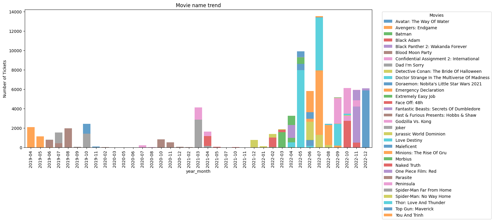

## 3.4 Customer value dimension


  Mục tiêu: Phân tích các chỉ số về giá trị mà 1 khách hàng mang lại

*   Frequency: count,day,month
*   Monetary: total_money, total_discount
*   Success rate = number / total
*   Promotion_rate = number_promotion / total_success
*   Discount_rate = sum_discount / sum_money


```python
df_join_all.head(2)
```

<table border="1" class="dataframe">
  <thead>
    <tr style="text-align: right;">
      <th></th>
      <th>ticket_id</th>
      <th>customer_id</th>
      <th>paying_method</th>
      <th>theater_name</th>
      <th>device_number</th>
      <th>original_price</th>
      <th>discount_value</th>
      <th>final_price</th>
      <th>time</th>
      <th>status_id</th>
      <th>campaign_id</th>
      <th>movie_name</th>
      <th>campaign_type</th>
      <th>usergender</th>
      <th>dob</th>
      <th>model</th>
      <th>platform</th>
      <th>description</th>
      <th>error_group</th>
      <th>age_days</th>
      <th>age</th>
      <th>month</th>
      <th>day_name</th>
      <th>hour</th>
      <th>year_month</th>
      <th>os_version</th>
      <th>type</th>
    </tr>
  </thead>
  <tbody>
    <tr>
      <th>0</th>
      <td>4f5200dcdcf2396b8d50ff84bf423f32</td>
      <td>100009</td>
      <td>money in app</td>
      <td>13.0</td>
      <td>244764a57dbdeb8fe9b164847ad55183</td>
      <td>9.90</td>
      <td>2.10</td>
      <td>7.80</td>
      <td>2022-07-08 17:46:36.145</td>
      <td>1</td>
      <td>83330</td>
      <td>Thor: Love And Thunder</td>
      <td>direct discount</td>
      <td>Male</td>
      <td>1989-02-25</td>
      <td>iPhone13,1</td>
      <td>mobile</td>
      <td>Order successful</td>
      <td>unknown</td>
      <td>13608</td>
      <td>37</td>
      <td>7</td>
      <td>Friday</td>
      <td>17</td>
      <td>2022-07</td>
      <td>ios</td>
      <td>promotion</td>
    </tr>
    <tr>
      <th>1</th>
      <td>07abbaf28c772692f0367ad992bb3184</td>
      <td>100493</td>
      <td>bank account</td>
      <td>180.0</td>
      <td>8fa83cf46284aafd6e5da6c96f7862b5</td>
      <td>8.66</td>
      <td>1.48</td>
      <td>7.18</td>
      <td>2022-07-15 20:44:09.952</td>
      <td>1</td>
      <td>83330</td>
      <td>Thor: Love And Thunder</td>
      <td>direct discount</td>
      <td>Male</td>
      <td>1991-06-09</td>
      <td>browser</td>
      <td>website</td>
      <td>Order successful</td>
      <td>unknown</td>
      <td>12774</td>
      <td>34</td>
      <td>7</td>
      <td>Friday</td>
      <td>20</td>
      <td>2022-07</td>
      <td>browser</td>
      <td>promotion</td>
    </tr>
  </tbody>
</table>

```python
# Tính các chỉ số cho những vé giao dịch thành công
def calculate_n_promotion(x):
  return (x=='promotion').sum()

df_success_metric = (
    df_join_all[df_join_all['status_id'] ==1]
    .assign( date= pd.to_datetime(df_join_all['time']).dt.date)
    .groupby('customer_id')
    .agg(
        n_success=('ticket_id','count'),
        s_money=('original_price','sum'),
        s_discount=('discount_value','sum'),
        n_days=('date','nunique'),
        n_months=('year_month','nunique'),
        n_promotions=('type',calculate_n_promotion)
        ).reset_index()
    )
```

```python
# Tính các chỉ số: total và số giao dịch lỗi:

def calculate_n_failed(x):
  return (x!=1).sum()

df_failed_metric = (
    df_join_all
    .groupby('customer_id')
    .agg(
        n_total = ('ticket_id','count'),
        n_failed = ('status_id',calculate_n_failed)
         ).reset_index()
    )
```

```python
# join 2 bảng

df_customer_value = pd.merge(df_failed_metric, df_success_metric, on='customer_id', how='left').fillna(0)
```

```python
df_customer_value['success_rate'] = df_customer_value['n_success'] / df_customer_value['n_total']
df_customer_value['promotion_rate'] = df_customer_value['n_promotions'] / df_customer_value['n_success']
df_customer_value['discount_rate'] = df_customer_value['s_discount'] / df_customer_value['s_money']
```

```python
df_customer_value.head(5)
```

<table border="1" class="dataframe">
  <thead>
    <tr style="text-align: right;">
      <th></th>
      <th>customer_id</th>
      <th>n_total</th>
      <th>n_failed</th>
      <th>n_success</th>
      <th>s_money</th>
      <th>s_discount</th>
      <th>n_days</th>
      <th>n_months</th>
      <th>n_promotions</th>
      <th>success_rate</th>
      <th>promotion_rate</th>
      <th>discount_rate</th>
    </tr>
  </thead>
  <tbody>
    <tr>
      <th>0</th>
      <td>100001</td>
      <td>1</td>
      <td>0</td>
      <td>1.0</td>
      <td>7.42</td>
      <td>2.06</td>
      <td>1.0</td>
      <td>1.0</td>
      <td>1.0</td>
      <td>1.0</td>
      <td>1.000000</td>
      <td>0.277628</td>
    </tr>
    <tr>
      <th>1</th>
      <td>100003</td>
      <td>6</td>
      <td>0</td>
      <td>6.0</td>
      <td>60.95</td>
      <td>2.56</td>
      <td>6.0</td>
      <td>6.0</td>
      <td>1.0</td>
      <td>1.0</td>
      <td>0.166667</td>
      <td>0.042002</td>
    </tr>
    <tr>
      <th>2</th>
      <td>100004</td>
      <td>1</td>
      <td>0</td>
      <td>1.0</td>
      <td>32.25</td>
      <td>0.00</td>
      <td>1.0</td>
      <td>1.0</td>
      <td>0.0</td>
      <td>1.0</td>
      <td>0.000000</td>
      <td>0.000000</td>
    </tr>
    <tr>
      <th>3</th>
      <td>100005</td>
      <td>1</td>
      <td>0</td>
      <td>1.0</td>
      <td>9.49</td>
      <td>2.06</td>
      <td>1.0</td>
      <td>1.0</td>
      <td>1.0</td>
      <td>1.0</td>
      <td>1.000000</td>
      <td>0.217071</td>
    </tr>
    <tr>
      <th>4</th>
      <td>100006</td>
      <td>1</td>
      <td>0</td>
      <td>1.0</td>
      <td>12.37</td>
      <td>0.00</td>
      <td>1.0</td>
      <td>1.0</td>
      <td>0.0</td>
      <td>1.0</td>
      <td>0.000000</td>
      <td>0.000000</td>
    </tr>
  </tbody>
</table>

```python
# Visualize tất cả các chỉ số bằng Histogram

df_customer_value.iloc[:,1:].hist(figsize=(12,10), grid = False , color='cornflowerblue', bins = 20)
plt.show()
```

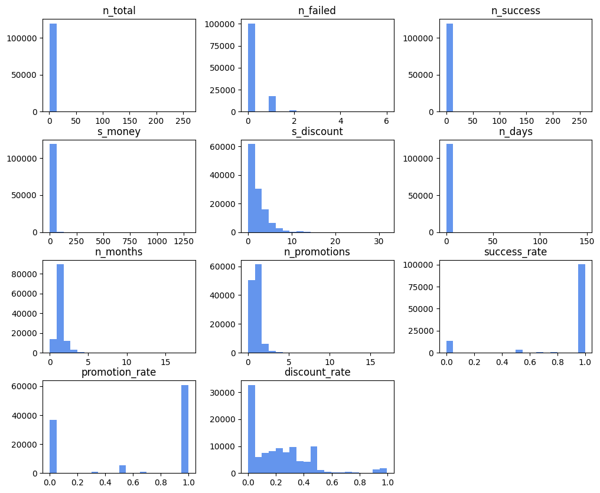

>- **Notes:**
>>- **n_total**: Hầu hết khách hàng mua vé rất ít, nhưng có những người mua rất nhiều --> check những người này.
>>- **success rate**: Có khoảng ~10% giao dịch SR = 0%
>>- **promotion**: Có hơn 60k khách hàng chỉ tham gia promotion khi rate = 100%

### Frequency & anomaly behavior

```python
df_customer_value['n_order_dis'] = df_customer_value['n_success'].apply(lambda x: 'more than 10' if x >= 10 else str(x))
```

```python
df_customer_value.head(2)
```

<table border="1" class="dataframe">
  <thead>
    <tr style="text-align: right;">
      <th></th>
      <th>customer_id</th>
      <th>n_total</th>
      <th>n_failed</th>
      <th>n_success</th>
      <th>s_money</th>
      <th>s_discount</th>
      <th>n_days</th>
      <th>n_months</th>
      <th>n_promotions</th>
      <th>success_rate</th>
      <th>promotion_rate</th>
      <th>discount_rate</th>
      <th>n_order_dis</th>
    </tr>
  </thead>
  <tbody>
    <tr>
      <th>0</th>
      <td>100001</td>
      <td>1</td>
      <td>0</td>
      <td>1.0</td>
      <td>7.42</td>
      <td>2.06</td>
      <td>1.0</td>
      <td>1.0</td>
      <td>1.0</td>
      <td>1.0</td>
      <td>1.000000</td>
      <td>0.277628</td>
      <td>1.0</td>
    </tr>
    <tr>
      <th>1</th>
      <td>100003</td>
      <td>6</td>
      <td>0</td>
      <td>6.0</td>
      <td>60.95</td>
      <td>2.56</td>
      <td>6.0</td>
      <td>6.0</td>
      <td>1.0</td>
      <td>1.0</td>
      <td>0.166667</td>
      <td>0.042002</td>
      <td>6.0</td>
    </tr>
  </tbody>
</table>

```python
df_n_dis = df_customer_value.groupby('n_order_dis').agg(
    total_cus=('customer_id','count')).reset_index()
```

```python
df_n_dis.head(2)
```

<table border="1" class="dataframe">
  <thead>
    <tr style="text-align: right;">
      <th></th>
      <th>n_order_dis</th>
      <th>total_cus</th>
    </tr>
  </thead>
  <tbody>
    <tr>
      <th>0</th>
      <td>0.0</td>
      <td>13701</td>
    </tr>
    <tr>
      <th>1</th>
      <td>1.0</td>
      <td>87921</td>
    </tr>
  </tbody>
</table>

```python
# Biểu đồ cột ngang
plt.figure(figsize=(8, 4))
plt.barh(
    df_n_dis['n_order_dis'], df_n_dis['total_cus'],
    color = 'cornflowerblue',alpha= 0.7
)

for index,value in enumerate(df_n_dis['total_cus']):
    plt.text(value,index,str(value))
plt.title('#customer of each group')

```

```console
Text(0.5, 1.0, '#customer of each group')
```

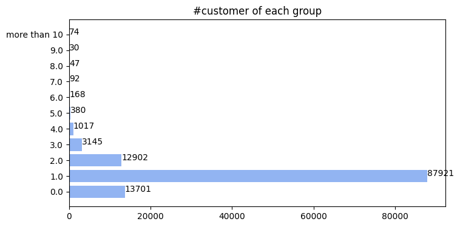

```python
# Nếu họ mua dồn vào 1 lúc --> bất thường
# Nếu họ mua dàn trải --> bình thường
```

```python
df_customer_value.sort_values(by='n_success', ascending=False).head(20)
```

<table border="1" class="dataframe">
  <thead>
    <tr style="text-align: right;">
      <th></th>
      <th>customer_id</th>
      <th>n_total</th>
      <th>n_failed</th>
      <th>n_success</th>
      <th>s_money</th>
      <th>s_discount</th>
      <th>n_days</th>
      <th>n_months</th>
      <th>n_promotions</th>
      <th>success_rate</th>
      <th>promotion_rate</th>
      <th>discount_rate</th>
      <th>n_order_dis</th>
    </tr>
  </thead>
  <tbody>
    <tr>
      <th>2686</th>
      <td>102948</td>
      <td>260</td>
      <td>0</td>
      <td>260.0</td>
      <td>1291.25</td>
      <td>3.38</td>
      <td>148.0</td>
      <td>18.0</td>
      <td>1.0</td>
      <td>1.000000</td>
      <td>0.003846</td>
      <td>0.002618</td>
      <td>more than 10</td>
    </tr>
    <tr>
      <th>48948</th>
      <td>153588</td>
      <td>108</td>
      <td>1</td>
      <td>107.0</td>
      <td>434.59</td>
      <td>0.00</td>
      <td>77.0</td>
      <td>14.0</td>
      <td>0.0</td>
      <td>0.990741</td>
      <td>0.000000</td>
      <td>0.000000</td>
      <td>more than 10</td>
    </tr>
    <tr>
      <th>10604</th>
      <td>111644</td>
      <td>104</td>
      <td>0</td>
      <td>104.0</td>
      <td>581.70</td>
      <td>18.52</td>
      <td>85.0</td>
      <td>18.0</td>
      <td>9.0</td>
      <td>1.000000</td>
      <td>0.086538</td>
      <td>0.031838</td>
      <td>more than 10</td>
    </tr>
    <tr>
      <th>15783</th>
      <td>117362</td>
      <td>104</td>
      <td>1</td>
      <td>103.0</td>
      <td>744.86</td>
      <td>8.62</td>
      <td>79.0</td>
      <td>15.0</td>
      <td>6.0</td>
      <td>0.990385</td>
      <td>0.058252</td>
      <td>0.011573</td>
      <td>more than 10</td>
    </tr>
    <tr>
      <th>16687</th>
      <td>118349</td>
      <td>83</td>
      <td>3</td>
      <td>80.0</td>
      <td>344.56</td>
      <td>4.21</td>
      <td>62.0</td>
      <td>17.0</td>
      <td>1.0</td>
      <td>0.963855</td>
      <td>0.012500</td>
      <td>0.012218</td>
      <td>more than 10</td>
    </tr>
    <tr>
      <th>20907</th>
      <td>122962</td>
      <td>77</td>
      <td>1</td>
      <td>76.0</td>
      <td>447.00</td>
      <td>1.86</td>
      <td>45.0</td>
      <td>9.0</td>
      <td>3.0</td>
      <td>0.987013</td>
      <td>0.039474</td>
      <td>0.004161</td>
      <td>more than 10</td>
    </tr>
    <tr>
      <th>72718</th>
      <td>179471</td>
      <td>69</td>
      <td>1</td>
      <td>68.0</td>
      <td>375.91</td>
      <td>7.14</td>
      <td>51.0</td>
      <td>9.0</td>
      <td>4.0</td>
      <td>0.985507</td>
      <td>0.058824</td>
      <td>0.018994</td>
      <td>more than 10</td>
    </tr>
    <tr>
      <th>62432</th>
      <td>168132</td>
      <td>69</td>
      <td>3</td>
      <td>66.0</td>
      <td>249.03</td>
      <td>0.00</td>
      <td>59.0</td>
      <td>14.0</td>
      <td>0.0</td>
      <td>0.956522</td>
      <td>0.000000</td>
      <td>0.000000</td>
      <td>more than 10</td>
    </tr>
    <tr>
      <th>111563</th>
      <td>222641</td>
      <td>51</td>
      <td>0</td>
      <td>51.0</td>
      <td>240.84</td>
      <td>2.31</td>
      <td>41.0</td>
      <td>11.0</td>
      <td>3.0</td>
      <td>1.000000</td>
      <td>0.058824</td>
      <td>0.009591</td>
      <td>more than 10</td>
    </tr>
    <tr>
      <th>53097</th>
      <td>158089</td>
      <td>53</td>
      <td>2</td>
      <td>51.0</td>
      <td>245.14</td>
      <td>1.69</td>
      <td>40.0</td>
      <td>14.0</td>
      <td>2.0</td>
      <td>0.962264</td>
      <td>0.039216</td>
      <td>0.006894</td>
      <td>more than 10</td>
    </tr>
    <tr>
      <th>115005</th>
      <td>226527</td>
      <td>49</td>
      <td>0</td>
      <td>49.0</td>
      <td>339.56</td>
      <td>12.79</td>
      <td>38.0</td>
      <td>7.0</td>
      <td>5.0</td>
      <td>1.000000</td>
      <td>0.102041</td>
      <td>0.037666</td>
      <td>more than 10</td>
    </tr>
    <tr>
      <th>15888</th>
      <td>117475</td>
      <td>49</td>
      <td>1</td>
      <td>48.0</td>
      <td>297.40</td>
      <td>2.56</td>
      <td>30.0</td>
      <td>13.0</td>
      <td>1.0</td>
      <td>0.979592</td>
      <td>0.020833</td>
      <td>0.008608</td>
      <td>more than 10</td>
    </tr>
    <tr>
      <th>48524</th>
      <td>153124</td>
      <td>49</td>
      <td>3</td>
      <td>46.0</td>
      <td>337.88</td>
      <td>27.02</td>
      <td>43.0</td>
      <td>17.0</td>
      <td>7.0</td>
      <td>0.938776</td>
      <td>0.152174</td>
      <td>0.079969</td>
      <td>more than 10</td>
    </tr>
    <tr>
      <th>7438</th>
      <td>108162</td>
      <td>44</td>
      <td>1</td>
      <td>43.0</td>
      <td>272.12</td>
      <td>6.72</td>
      <td>38.0</td>
      <td>14.0</td>
      <td>2.0</td>
      <td>0.977273</td>
      <td>0.046512</td>
      <td>0.024695</td>
      <td>more than 10</td>
    </tr>
    <tr>
      <th>7389</th>
      <td>108110</td>
      <td>43</td>
      <td>2</td>
      <td>41.0</td>
      <td>184.65</td>
      <td>1.24</td>
      <td>32.0</td>
      <td>10.0</td>
      <td>2.0</td>
      <td>0.953488</td>
      <td>0.048780</td>
      <td>0.006715</td>
      <td>more than 10</td>
    </tr>
    <tr>
      <th>29091</th>
      <td>131905</td>
      <td>39</td>
      <td>1</td>
      <td>38.0</td>
      <td>242.70</td>
      <td>0.00</td>
      <td>35.0</td>
      <td>18.0</td>
      <td>0.0</td>
      <td>0.974359</td>
      <td>0.000000</td>
      <td>0.000000</td>
      <td>more than 10</td>
    </tr>
    <tr>
      <th>115304</th>
      <td>226886</td>
      <td>37</td>
      <td>0</td>
      <td>37.0</td>
      <td>186.01</td>
      <td>1.90</td>
      <td>27.0</td>
      <td>5.0</td>
      <td>1.0</td>
      <td>1.000000</td>
      <td>0.027027</td>
      <td>0.010215</td>
      <td>more than 10</td>
    </tr>
    <tr>
      <th>15581</th>
      <td>117140</td>
      <td>36</td>
      <td>0</td>
      <td>36.0</td>
      <td>150.73</td>
      <td>13.11</td>
      <td>31.0</td>
      <td>15.0</td>
      <td>5.0</td>
      <td>1.000000</td>
      <td>0.138889</td>
      <td>0.086977</td>
      <td>more than 10</td>
    </tr>
    <tr>
      <th>7947</th>
      <td>108729</td>
      <td>34</td>
      <td>0</td>
      <td>34.0</td>
      <td>163.40</td>
      <td>0.00</td>
      <td>29.0</td>
      <td>4.0</td>
      <td>0.0</td>
      <td>1.000000</td>
      <td>0.000000</td>
      <td>0.000000</td>
      <td>more than 10</td>
    </tr>
    <tr>
      <th>2765</th>
      <td>103035</td>
      <td>34</td>
      <td>0</td>
      <td>34.0</td>
      <td>318.70</td>
      <td>0.00</td>
      <td>24.0</td>
      <td>10.0</td>
      <td>0.0</td>
      <td>1.000000</td>
      <td>0.000000</td>
      <td>0.000000</td>
      <td>more than 10</td>
    </tr>
  </tbody>
</table>

```python
list_customer_massive = list(df_customer_value[df_customer_value['n_success'] > 30 ]['customer_id'].unique())
```

```python
list_customer_massive
```

```console
[np.int64(102948),
 np.int64(103035),
 np.int64(103347),
 np.int64(108110),
 np.int64(108162),
 np.int64(108729),
 np.int64(111644),
 np.int64(114205),
 np.int64(117140),
 np.int64(117362),
 np.int64(117475),
 np.int64(118349),
 np.int64(122962),
 np.int64(131905),
 np.int64(153124),
 np.int64(153588),
 np.int64(158089),
 np.int64(168132),
 np.int64(179471),
 np.int64(222641),
 np.int64(226527),
 np.int64(226886)]
```

```python
df_customer_massive_pivot = (
    df_join_all[(df_join_all['customer_id'].isin(list_customer_massive)) & (df_join_all['status_id'] == 1)]
    .pivot_table(index='year_month', columns='customer_id', aggfunc='count', values='ticket_id')
    .reset_index()
)
```

```python
df_customer_massive_pivot.head(10)
```

<table border="1" class="dataframe">
  <thead>
    <tr style="text-align: right;">
      <th>customer_id</th>
      <th>year_month</th>
      <th>102948</th>
      <th>103035</th>
      <th>103347</th>
      <th>108110</th>
      <th>108162</th>
      <th>108729</th>
      <th>111644</th>
      <th>114205</th>
      <th>117140</th>
      <th>117362</th>
      <th>117475</th>
      <th>118349</th>
      <th>122962</th>
      <th>131905</th>
      <th>153124</th>
      <th>153588</th>
      <th>158089</th>
      <th>168132</th>
      <th>179471</th>
      <th>222641</th>
      <th>226527</th>
      <th>226886</th>
    </tr>
  </thead>
  <tbody>
    <tr>
      <th>0</th>
      <td>2019-01</td>
      <td>NaN</td>
      <td>NaN</td>
      <td>NaN</td>
      <td>NaN</td>
      <td>1.0</td>
      <td>NaN</td>
      <td>NaN</td>
      <td>1.0</td>
      <td>NaN</td>
      <td>NaN</td>
      <td>NaN</td>
      <td>NaN</td>
      <td>NaN</td>
      <td>NaN</td>
      <td>NaN</td>
      <td>NaN</td>
      <td>NaN</td>
      <td>NaN</td>
      <td>NaN</td>
      <td>NaN</td>
      <td>NaN</td>
      <td>NaN</td>
    </tr>
    <tr>
      <th>1</th>
      <td>2019-02</td>
      <td>NaN</td>
      <td>NaN</td>
      <td>NaN</td>
      <td>NaN</td>
      <td>1.0</td>
      <td>NaN</td>
      <td>NaN</td>
      <td>2.0</td>
      <td>NaN</td>
      <td>NaN</td>
      <td>NaN</td>
      <td>NaN</td>
      <td>NaN</td>
      <td>NaN</td>
      <td>NaN</td>
      <td>NaN</td>
      <td>NaN</td>
      <td>NaN</td>
      <td>NaN</td>
      <td>NaN</td>
      <td>NaN</td>
      <td>NaN</td>
    </tr>
    <tr>
      <th>2</th>
      <td>2019-03</td>
      <td>NaN</td>
      <td>NaN</td>
      <td>NaN</td>
      <td>NaN</td>
      <td>NaN</td>
      <td>NaN</td>
      <td>NaN</td>
      <td>1.0</td>
      <td>NaN</td>
      <td>NaN</td>
      <td>NaN</td>
      <td>NaN</td>
      <td>NaN</td>
      <td>NaN</td>
      <td>NaN</td>
      <td>NaN</td>
      <td>NaN</td>
      <td>NaN</td>
      <td>NaN</td>
      <td>NaN</td>
      <td>NaN</td>
      <td>NaN</td>
    </tr>
    <tr>
      <th>3</th>
      <td>2019-04</td>
      <td>NaN</td>
      <td>3.0</td>
      <td>NaN</td>
      <td>NaN</td>
      <td>1.0</td>
      <td>NaN</td>
      <td>NaN</td>
      <td>NaN</td>
      <td>NaN</td>
      <td>NaN</td>
      <td>NaN</td>
      <td>NaN</td>
      <td>NaN</td>
      <td>3.0</td>
      <td>2.0</td>
      <td>NaN</td>
      <td>3.0</td>
      <td>NaN</td>
      <td>NaN</td>
      <td>NaN</td>
      <td>NaN</td>
      <td>NaN</td>
    </tr>
    <tr>
      <th>4</th>
      <td>2019-05</td>
      <td>NaN</td>
      <td>2.0</td>
      <td>NaN</td>
      <td>NaN</td>
      <td>4.0</td>
      <td>NaN</td>
      <td>NaN</td>
      <td>NaN</td>
      <td>1.0</td>
      <td>NaN</td>
      <td>NaN</td>
      <td>1.0</td>
      <td>NaN</td>
      <td>2.0</td>
      <td>3.0</td>
      <td>NaN</td>
      <td>7.0</td>
      <td>NaN</td>
      <td>NaN</td>
      <td>NaN</td>
      <td>NaN</td>
      <td>NaN</td>
    </tr>
    <tr>
      <th>5</th>
      <td>2019-06</td>
      <td>NaN</td>
      <td>NaN</td>
      <td>NaN</td>
      <td>NaN</td>
      <td>2.0</td>
      <td>NaN</td>
      <td>NaN</td>
      <td>2.0</td>
      <td>1.0</td>
      <td>NaN</td>
      <td>1.0</td>
      <td>NaN</td>
      <td>NaN</td>
      <td>1.0</td>
      <td>7.0</td>
      <td>NaN</td>
      <td>2.0</td>
      <td>NaN</td>
      <td>NaN</td>
      <td>NaN</td>
      <td>NaN</td>
      <td>NaN</td>
    </tr>
    <tr>
      <th>6</th>
      <td>2019-07</td>
      <td>NaN</td>
      <td>NaN</td>
      <td>NaN</td>
      <td>NaN</td>
      <td>NaN</td>
      <td>NaN</td>
      <td>NaN</td>
      <td>3.0</td>
      <td>NaN</td>
      <td>NaN</td>
      <td>NaN</td>
      <td>NaN</td>
      <td>NaN</td>
      <td>NaN</td>
      <td>5.0</td>
      <td>NaN</td>
      <td>3.0</td>
      <td>NaN</td>
      <td>NaN</td>
      <td>NaN</td>
      <td>NaN</td>
      <td>NaN</td>
    </tr>
    <tr>
      <th>7</th>
      <td>2019-08</td>
      <td>NaN</td>
      <td>3.0</td>
      <td>NaN</td>
      <td>NaN</td>
      <td>NaN</td>
      <td>NaN</td>
      <td>NaN</td>
      <td>6.0</td>
      <td>NaN</td>
      <td>NaN</td>
      <td>NaN</td>
      <td>NaN</td>
      <td>NaN</td>
      <td>1.0</td>
      <td>7.0</td>
      <td>NaN</td>
      <td>5.0</td>
      <td>NaN</td>
      <td>NaN</td>
      <td>NaN</td>
      <td>NaN</td>
      <td>NaN</td>
    </tr>
    <tr>
      <th>8</th>
      <td>2019-09</td>
      <td>NaN</td>
      <td>2.0</td>
      <td>NaN</td>
      <td>NaN</td>
      <td>NaN</td>
      <td>NaN</td>
      <td>NaN</td>
      <td>2.0</td>
      <td>NaN</td>
      <td>NaN</td>
      <td>NaN</td>
      <td>NaN</td>
      <td>NaN</td>
      <td>2.0</td>
      <td>1.0</td>
      <td>NaN</td>
      <td>2.0</td>
      <td>NaN</td>
      <td>NaN</td>
      <td>NaN</td>
      <td>NaN</td>
      <td>NaN</td>
    </tr>
    <tr>
      <th>9</th>
      <td>2019-10</td>
      <td>NaN</td>
      <td>4.0</td>
      <td>NaN</td>
      <td>NaN</td>
      <td>NaN</td>
      <td>NaN</td>
      <td>1.0</td>
      <td>3.0</td>
      <td>NaN</td>
      <td>NaN</td>
      <td>NaN</td>
      <td>NaN</td>
      <td>NaN</td>
      <td>1.0</td>
      <td>1.0</td>
      <td>NaN</td>
      <td>7.0</td>
      <td>NaN</td>
      <td>NaN</td>
      <td>NaN</td>
      <td>NaN</td>
      <td>NaN</td>
    </tr>
  </tbody>
</table>

```python
#Biểu đồ cột chồng
ax = df_customer_massive_pivot.plot(x = 'year_month', kind='bar', stacked=True, figsize=(15, 6), width=0.8, alpha = 0.7)

# Set the title and labels
ax.set_title('Massive customers trend')
# ax.set_xlabel('Month')
ax.set_ylabel('Number of Tickets')

# Add a legend
plt.legend(title='customer_id', loc='upper right', bbox_to_anchor=(1.15, 1))

# Show the plot
plt.show()
```

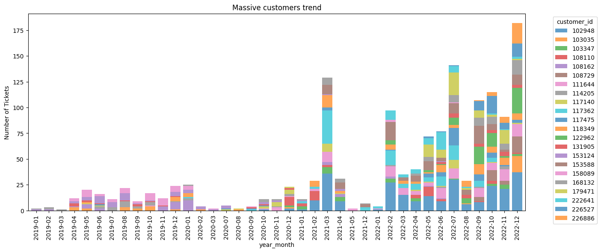

>- **Notes:**
>>- Nhóm khách hàng mua vé > 30 lượt phân bố dàn trải --> không có hiện tượng spam vé, mua đi bán lại.
>>- Chưa có gì bất thường.

### Massive promotion

```python
df_customer_value['n_promo_dis'] = df_customer_value['n_promotions'].apply(lambda x: 'more than 10' if x >= 10 else str(x))
```

```python
df_promo_dis = df_customer_value.groupby('n_promo_dis').agg(
    total_cus=('customer_id','count')).reset_index()
```

```python
df_promo_dis.head(10)
```

<table border="1" class="dataframe">
  <thead>
    <tr style="text-align: right;">
      <th></th>
      <th>n_promo_dis</th>
      <th>total_cus</th>
    </tr>
  </thead>
  <tbody>
    <tr>
      <th>0</th>
      <td>0.0</td>
      <td>50498</td>
    </tr>
    <tr>
      <th>1</th>
      <td>1.0</td>
      <td>61334</td>
    </tr>
    <tr>
      <th>2</th>
      <td>2.0</td>
      <td>6264</td>
    </tr>
    <tr>
      <th>3</th>
      <td>3.0</td>
      <td>1042</td>
    </tr>
    <tr>
      <th>4</th>
      <td>4.0</td>
      <td>230</td>
    </tr>
    <tr>
      <th>5</th>
      <td>5.0</td>
      <td>74</td>
    </tr>
    <tr>
      <th>6</th>
      <td>6.0</td>
      <td>19</td>
    </tr>
    <tr>
      <th>7</th>
      <td>7.0</td>
      <td>10</td>
    </tr>
    <tr>
      <th>8</th>
      <td>8.0</td>
      <td>2</td>
    </tr>
    <tr>
      <th>9</th>
      <td>9.0</td>
      <td>2</td>
    </tr>
  </tbody>
</table>

```python
# Biểu đồ cột ngang
plt.figure(figsize=(8, 4))

plt.barh(
    df_promo_dis['n_promo_dis'], df_promo_dis['total_cus'],
    color = 'cornflowerblue',alpha= 0.8
)

for index,value in enumerate(df_promo_dis['total_cus']):
    plt.text(value,index,str(value))

plt.title('#distribution of number tickets by customer')
plt.show()
```

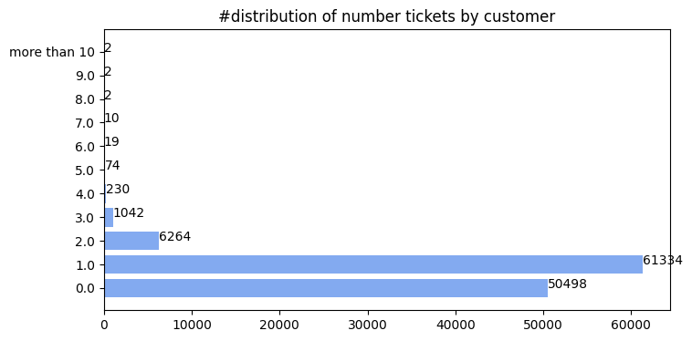

>>- ~60% KH là có join vào các chương trình khuyến mãi
>>- Trong đó 90% là chỉ hưởng khuyến mãi 1 lần duy nhất
>>>- 1. Khách hàng đến 1 lần rồi thôi
>>>- 2. Các chương trình chỉ cho 1 người dùng 1 lần (danh cho new customers)??? --> verify với các team Product hoặc Marketing

```python
# Vậy loại khuyến mãi khách hàng đang dùng là gì ?
```

```python
df_join_all.head(2)
```

<table border="1" class="dataframe">
  <thead>
    <tr style="text-align: right;">
      <th></th>
      <th>ticket_id</th>
      <th>customer_id</th>
      <th>paying_method</th>
      <th>theater_name</th>
      <th>device_number</th>
      <th>original_price</th>
      <th>discount_value</th>
      <th>final_price</th>
      <th>time</th>
      <th>status_id</th>
      <th>campaign_id</th>
      <th>movie_name</th>
      <th>campaign_type</th>
      <th>usergender</th>
      <th>dob</th>
      <th>model</th>
      <th>platform</th>
      <th>description</th>
      <th>error_group</th>
      <th>age_days</th>
      <th>age</th>
      <th>month</th>
      <th>day_name</th>
      <th>hour</th>
      <th>year_month</th>
      <th>os_version</th>
      <th>type</th>
    </tr>
  </thead>
  <tbody>
    <tr>
      <th>0</th>
      <td>4f5200dcdcf2396b8d50ff84bf423f32</td>
      <td>100009</td>
      <td>money in app</td>
      <td>13.0</td>
      <td>244764a57dbdeb8fe9b164847ad55183</td>
      <td>9.90</td>
      <td>2.10</td>
      <td>7.80</td>
      <td>2022-07-08 17:46:36.145</td>
      <td>1</td>
      <td>83330</td>
      <td>Thor: Love And Thunder</td>
      <td>direct discount</td>
      <td>Male</td>
      <td>1989-02-25</td>
      <td>iPhone13,1</td>
      <td>mobile</td>
      <td>Order successful</td>
      <td>unknown</td>
      <td>13608</td>
      <td>37</td>
      <td>7</td>
      <td>Friday</td>
      <td>17</td>
      <td>2022-07</td>
      <td>ios</td>
      <td>promotion</td>
    </tr>
    <tr>
      <th>1</th>
      <td>07abbaf28c772692f0367ad992bb3184</td>
      <td>100493</td>
      <td>bank account</td>
      <td>180.0</td>
      <td>8fa83cf46284aafd6e5da6c96f7862b5</td>
      <td>8.66</td>
      <td>1.48</td>
      <td>7.18</td>
      <td>2022-07-15 20:44:09.952</td>
      <td>1</td>
      <td>83330</td>
      <td>Thor: Love And Thunder</td>
      <td>direct discount</td>
      <td>Male</td>
      <td>1991-06-09</td>
      <td>browser</td>
      <td>website</td>
      <td>Order successful</td>
      <td>unknown</td>
      <td>12774</td>
      <td>34</td>
      <td>7</td>
      <td>Friday</td>
      <td>20</td>
      <td>2022-07</td>
      <td>browser</td>
      <td>promotion</td>
    </tr>
  </tbody>
</table>

```python
# Đánh giá loại khuyến mãi mà khách hàng dùng:
df_type_group = (
    df_join_all[(df_join_all['status_id'] ==1) &  (df_join_all['type'] == 'promotion')]
    .groupby(['campaign_type'])
    .agg(
        total=('ticket_id','count')
    )
    .reset_index()
)
```

```python
df_type_group
```

<table border="1" class="dataframe">
  <thead>
    <tr style="text-align: right;">
      <th></th>
      <th>campaign_type</th>
      <th>total</th>
    </tr>
  </thead>
  <tbody>
    <tr>
      <th>0</th>
      <td>direct discount</td>
      <td>68449</td>
    </tr>
    <tr>
      <th>1</th>
      <td>reward point</td>
      <td>3150</td>
    </tr>
    <tr>
      <th>2</th>
      <td>voucher</td>
      <td>6924</td>
    </tr>
  </tbody>
</table>

```python
# Tính tỉ lệ loại khuyến mãi chi tiết cho từng nhóm khách hàng

```

```python
df_n_success = (
    df_join_all[(df_join_all['status_id'] ==1) &  (df_join_all['type'] == 'promotion')]
    .groupby('customer_id')
    .agg(
        n_promotions=('ticket_id','count')
))
```

```python
df_n_pivot = (df_join_all[(df_join_all['status_id'] == 1 ) & (df_join_all['type'] == 'promotion')]
                  .pivot_table(index='customer_id', columns='campaign_type', aggfunc='count', values='ticket_id')
                  .reset_index())
```

```python
df_n_pivot.head(10)
```

<table border="1" class="dataframe">
  <thead>
    <tr style="text-align: right;">
      <th>campaign_type</th>
      <th>customer_id</th>
      <th>direct discount</th>
      <th>reward point</th>
      <th>voucher</th>
    </tr>
  </thead>
  <tbody>
    <tr>
      <th>0</th>
      <td>100001</td>
      <td>NaN</td>
      <td>NaN</td>
      <td>1.0</td>
    </tr>
    <tr>
      <th>1</th>
      <td>100003</td>
      <td>1.0</td>
      <td>NaN</td>
      <td>NaN</td>
    </tr>
    <tr>
      <th>2</th>
      <td>100005</td>
      <td>NaN</td>
      <td>NaN</td>
      <td>1.0</td>
    </tr>
    <tr>
      <th>3</th>
      <td>100007</td>
      <td>1.0</td>
      <td>NaN</td>
      <td>NaN</td>
    </tr>
    <tr>
      <th>4</th>
      <td>100009</td>
      <td>7.0</td>
      <td>NaN</td>
      <td>NaN</td>
    </tr>
    <tr>
      <th>5</th>
      <td>100010</td>
      <td>1.0</td>
      <td>NaN</td>
      <td>NaN</td>
    </tr>
    <tr>
      <th>6</th>
      <td>100014</td>
      <td>2.0</td>
      <td>NaN</td>
      <td>NaN</td>
    </tr>
    <tr>
      <th>7</th>
      <td>100015</td>
      <td>NaN</td>
      <td>NaN</td>
      <td>2.0</td>
    </tr>
    <tr>
      <th>8</th>
      <td>100018</td>
      <td>1.0</td>
      <td>NaN</td>
      <td>NaN</td>
    </tr>
    <tr>
      <th>9</th>
      <td>100020</td>
      <td>1.0</td>
      <td>NaN</td>
      <td>NaN</td>
    </tr>
  </tbody>
</table>

```python
df_n_join = (
    pd.merge(df_n_pivot, df_n_success, on='customer_id', how='inner')
    .groupby('n_promotions').agg(
         n_cus = ('customer_id','count'),
         n_voucher = ('voucher','sum'),
         n_d_discount = ('direct discount','sum'),
         n_reward_point = ('reward point','sum')
         ).reset_index()
)
```

```python
df_n_join.head(10)
```

<table border="1" class="dataframe">
  <thead>
    <tr style="text-align: right;">
      <th></th>
      <th>n_promotions</th>
      <th>n_cus</th>
      <th>n_voucher</th>
      <th>n_d_discount</th>
      <th>n_reward_point</th>
    </tr>
  </thead>
  <tbody>
    <tr>
      <th>0</th>
      <td>1</td>
      <td>61334</td>
      <td>5358.0</td>
      <td>53098.0</td>
      <td>2878.0</td>
    </tr>
    <tr>
      <th>1</th>
      <td>2</td>
      <td>6264</td>
      <td>1091.0</td>
      <td>11222.0</td>
      <td>215.0</td>
    </tr>
    <tr>
      <th>2</th>
      <td>3</td>
      <td>1042</td>
      <td>293.0</td>
      <td>2788.0</td>
      <td>45.0</td>
    </tr>
    <tr>
      <th>3</th>
      <td>4</td>
      <td>230</td>
      <td>87.0</td>
      <td>827.0</td>
      <td>6.0</td>
    </tr>
    <tr>
      <th>4</th>
      <td>5</td>
      <td>74</td>
      <td>43.0</td>
      <td>323.0</td>
      <td>4.0</td>
    </tr>
    <tr>
      <th>5</th>
      <td>6</td>
      <td>19</td>
      <td>12.0</td>
      <td>102.0</td>
      <td>0.0</td>
    </tr>
    <tr>
      <th>6</th>
      <td>7</td>
      <td>10</td>
      <td>14.0</td>
      <td>54.0</td>
      <td>2.0</td>
    </tr>
    <tr>
      <th>7</th>
      <td>8</td>
      <td>2</td>
      <td>2.0</td>
      <td>14.0</td>
      <td>0.0</td>
    </tr>
    <tr>
      <th>8</th>
      <td>9</td>
      <td>2</td>
      <td>6.0</td>
      <td>12.0</td>
      <td>0.0</td>
    </tr>
    <tr>
      <th>9</th>
      <td>10</td>
      <td>1</td>
      <td>1.0</td>
      <td>9.0</td>
      <td>0.0</td>
    </tr>
  </tbody>
</table>

```python
df_n_join['total'] = df_n_join.iloc[:,2:].sum(axis=1)
```

```python
for i in df_n_join.columns[2:5]:
  df_n_join[i+'_pct'] = df_n_join[i] / df_n_join['total']
```

```python
df_n_join.head(10)
```

<table border="1" class="dataframe">
  <thead>
    <tr style="text-align: right;">
      <th></th>
      <th>n_promotions</th>
      <th>n_cus</th>
      <th>n_voucher</th>
      <th>n_d_discount</th>
      <th>n_reward_point</th>
      <th>total</th>
      <th>n_voucher_pct</th>
      <th>n_d_discount_pct</th>
      <th>n_reward_point_pct</th>
    </tr>
  </thead>
  <tbody>
    <tr>
      <th>0</th>
      <td>1</td>
      <td>61334</td>
      <td>5358.0</td>
      <td>53098.0</td>
      <td>2878.0</td>
      <td>61334.0</td>
      <td>0.087358</td>
      <td>0.865719</td>
      <td>0.046923</td>
    </tr>
    <tr>
      <th>1</th>
      <td>2</td>
      <td>6264</td>
      <td>1091.0</td>
      <td>11222.0</td>
      <td>215.0</td>
      <td>12528.0</td>
      <td>0.087085</td>
      <td>0.895754</td>
      <td>0.017162</td>
    </tr>
    <tr>
      <th>2</th>
      <td>3</td>
      <td>1042</td>
      <td>293.0</td>
      <td>2788.0</td>
      <td>45.0</td>
      <td>3126.0</td>
      <td>0.093730</td>
      <td>0.891875</td>
      <td>0.014395</td>
    </tr>
    <tr>
      <th>3</th>
      <td>4</td>
      <td>230</td>
      <td>87.0</td>
      <td>827.0</td>
      <td>6.0</td>
      <td>920.0</td>
      <td>0.094565</td>
      <td>0.898913</td>
      <td>0.006522</td>
    </tr>
    <tr>
      <th>4</th>
      <td>5</td>
      <td>74</td>
      <td>43.0</td>
      <td>323.0</td>
      <td>4.0</td>
      <td>370.0</td>
      <td>0.116216</td>
      <td>0.872973</td>
      <td>0.010811</td>
    </tr>
    <tr>
      <th>5</th>
      <td>6</td>
      <td>19</td>
      <td>12.0</td>
      <td>102.0</td>
      <td>0.0</td>
      <td>114.0</td>
      <td>0.105263</td>
      <td>0.894737</td>
      <td>0.000000</td>
    </tr>
    <tr>
      <th>6</th>
      <td>7</td>
      <td>10</td>
      <td>14.0</td>
      <td>54.0</td>
      <td>2.0</td>
      <td>70.0</td>
      <td>0.200000</td>
      <td>0.771429</td>
      <td>0.028571</td>
    </tr>
    <tr>
      <th>7</th>
      <td>8</td>
      <td>2</td>
      <td>2.0</td>
      <td>14.0</td>
      <td>0.0</td>
      <td>16.0</td>
      <td>0.125000</td>
      <td>0.875000</td>
      <td>0.000000</td>
    </tr>
    <tr>
      <th>8</th>
      <td>9</td>
      <td>2</td>
      <td>6.0</td>
      <td>12.0</td>
      <td>0.0</td>
      <td>18.0</td>
      <td>0.333333</td>
      <td>0.666667</td>
      <td>0.000000</td>
    </tr>
    <tr>
      <th>9</th>
      <td>10</td>
      <td>1</td>
      <td>1.0</td>
      <td>9.0</td>
      <td>0.0</td>
      <td>10.0</td>
      <td>0.100000</td>
      <td>0.900000</td>
      <td>0.000000</td>
    </tr>
  </tbody>
</table>

```python
format_dict = {'total': '{:.0f}', 'n_voucher_pct':'{:.0%}', 'n_d_discount_pct':'{:.0%}', 'n_reward_point_pct':'{:.0%}'}
```

```python
# heat map cho table
(
    df_n_join.drop(columns = ['n_voucher','n_d_discount','n_reward_point'])
    .style.format(format_dict)
    .background_gradient(subset = ['n_voucher_pct', 'n_d_discount_pct', 'n_reward_point_pct'], cmap='PuBu')
    .background_gradient(subset = ['total'], cmap='YlGn')
)
```

<table id="T_e444e" class="dataframe">
  <thead>
    <tr>
      <th class="blank level0" >&nbsp;</th>
      <th id="T_e444e_level0_col0" class="col_heading level0 col0" >n_promotions</th>
      <th id="T_e444e_level0_col1" class="col_heading level0 col1" >n_cus</th>
      <th id="T_e444e_level0_col2" class="col_heading level0 col2" >total</th>
      <th id="T_e444e_level0_col3" class="col_heading level0 col3" >n_voucher_pct</th>
      <th id="T_e444e_level0_col4" class="col_heading level0 col4" >n_d_discount_pct</th>
      <th id="T_e444e_level0_col5" class="col_heading level0 col5" >n_reward_point_pct</th>
    </tr>
  </thead>
  <tbody>
    <tr>
      <th id="T_e444e_level0_row0" class="row_heading level0 row0" >0</th>
      <td id="T_e444e_row0_col0" class="data row0 col0" >1</td>
      <td id="T_e444e_row0_col1" class="data row0 col1" >61334</td>
      <td id="T_e444e_row0_col2" class="data row0 col2" >61334</td>
      <td id="T_e444e_row0_col3" class="data row0 col3" >9%</td>
      <td id="T_e444e_row0_col4" class="data row0 col4" >87%</td>
      <td id="T_e444e_row0_col5" class="data row0 col5" >5%</td>
    </tr>
    <tr>
      <th id="T_e444e_level0_row1" class="row_heading level0 row1" >1</th>
      <td id="T_e444e_row1_col0" class="data row1 col0" >2</td>
      <td id="T_e444e_row1_col1" class="data row1 col1" >6264</td>
      <td id="T_e444e_row1_col2" class="data row1 col2" >12528</td>
      <td id="T_e444e_row1_col3" class="data row1 col3" >9%</td>
      <td id="T_e444e_row1_col4" class="data row1 col4" >90%</td>
      <td id="T_e444e_row1_col5" class="data row1 col5" >2%</td>
    </tr>
    <tr>
      <th id="T_e444e_level0_row2" class="row_heading level0 row2" >2</th>
      <td id="T_e444e_row2_col0" class="data row2 col0" >3</td>
      <td id="T_e444e_row2_col1" class="data row2 col1" >1042</td>
      <td id="T_e444e_row2_col2" class="data row2 col2" >3126</td>
      <td id="T_e444e_row2_col3" class="data row2 col3" >9%</td>
      <td id="T_e444e_row2_col4" class="data row2 col4" >89%</td>
      <td id="T_e444e_row2_col5" class="data row2 col5" >1%</td>
    </tr>
    <tr>
      <th id="T_e444e_level0_row3" class="row_heading level0 row3" >3</th>
      <td id="T_e444e_row3_col0" class="data row3 col0" >4</td>
      <td id="T_e444e_row3_col1" class="data row3 col1" >230</td>
      <td id="T_e444e_row3_col2" class="data row3 col2" >920</td>
      <td id="T_e444e_row3_col3" class="data row3 col3" >9%</td>
      <td id="T_e444e_row3_col4" class="data row3 col4" >90%</td>
      <td id="T_e444e_row3_col5" class="data row3 col5" >1%</td>
    </tr>
    <tr>
      <th id="T_e444e_level0_row4" class="row_heading level0 row4" >4</th>
      <td id="T_e444e_row4_col0" class="data row4 col0" >5</td>
      <td id="T_e444e_row4_col1" class="data row4 col1" >74</td>
      <td id="T_e444e_row4_col2" class="data row4 col2" >370</td>
      <td id="T_e444e_row4_col3" class="data row4 col3" >12%</td>
      <td id="T_e444e_row4_col4" class="data row4 col4" >87%</td>
      <td id="T_e444e_row4_col5" class="data row4 col5" >1%</td>
    </tr>
    <tr>
      <th id="T_e444e_level0_row5" class="row_heading level0 row5" >5</th>
      <td id="T_e444e_row5_col0" class="data row5 col0" >6</td>
      <td id="T_e444e_row5_col1" class="data row5 col1" >19</td>
      <td id="T_e444e_row5_col2" class="data row5 col2" >114</td>
      <td id="T_e444e_row5_col3" class="data row5 col3" >11%</td>
      <td id="T_e444e_row5_col4" class="data row5 col4" >89%</td>
      <td id="T_e444e_row5_col5" class="data row5 col5" >0%</td>
    </tr>
    <tr>
      <th id="T_e444e_level0_row6" class="row_heading level0 row6" >6</th>
      <td id="T_e444e_row6_col0" class="data row6 col0" >7</td>
      <td id="T_e444e_row6_col1" class="data row6 col1" >10</td>
      <td id="T_e444e_row6_col2" class="data row6 col2" >70</td>
      <td id="T_e444e_row6_col3" class="data row6 col3" >20%</td>
      <td id="T_e444e_row6_col4" class="data row6 col4" >77%</td>
      <td id="T_e444e_row6_col5" class="data row6 col5" >3%</td>
    </tr>
    <tr>
      <th id="T_e444e_level0_row7" class="row_heading level0 row7" >7</th>
      <td id="T_e444e_row7_col0" class="data row7 col0" >8</td>
      <td id="T_e444e_row7_col1" class="data row7 col1" >2</td>
      <td id="T_e444e_row7_col2" class="data row7 col2" >16</td>
      <td id="T_e444e_row7_col3" class="data row7 col3" >12%</td>
      <td id="T_e444e_row7_col4" class="data row7 col4" >88%</td>
      <td id="T_e444e_row7_col5" class="data row7 col5" >0%</td>
    </tr>
    <tr>
      <th id="T_e444e_level0_row8" class="row_heading level0 row8" >8</th>
      <td id="T_e444e_row8_col0" class="data row8 col0" >9</td>
      <td id="T_e444e_row8_col1" class="data row8 col1" >2</td>
      <td id="T_e444e_row8_col2" class="data row8 col2" >18</td>
      <td id="T_e444e_row8_col3" class="data row8 col3" >33%</td>
      <td id="T_e444e_row8_col4" class="data row8 col4" >67%</td>
      <td id="T_e444e_row8_col5" class="data row8 col5" >0%</td>
    </tr>
    <tr>
      <th id="T_e444e_level0_row9" class="row_heading level0 row9" >9</th>
      <td id="T_e444e_row9_col0" class="data row9 col0" >10</td>
      <td id="T_e444e_row9_col1" class="data row9 col1" >1</td>
      <td id="T_e444e_row9_col2" class="data row9 col2" >10</td>
      <td id="T_e444e_row9_col3" class="data row9 col3" >10%</td>
      <td id="T_e444e_row9_col4" class="data row9 col4" >90%</td>
      <td id="T_e444e_row9_col5" class="data row9 col5" >0%</td>
    </tr>
    <tr>
      <th id="T_e444e_level0_row10" class="row_heading level0 row10" >10</th>
      <td id="T_e444e_row10_col0" class="data row10 col0" >17</td>
      <td id="T_e444e_row10_col1" class="data row10 col1" >1</td>
      <td id="T_e444e_row10_col2" class="data row10 col2" >17</td>
      <td id="T_e444e_row10_col3" class="data row10 col3" >100%</td>
      <td id="T_e444e_row10_col4" class="data row10 col4" >0%</td>
      <td id="T_e444e_row10_col5" class="data row10 col5" >0%</td>
    </tr>
  </tbody>
</table>

> **Notes:**
>>- ~90% KH chọn tham gia các campaign direct discount
>>- Đánh giá thêm về retention của KH --> Quay trở lại ? --> Hiệu quả của MKT

## 3.5 Customer retention

```python
from operator import attrgetter
import matplotlib.colors as mcolors
import seaborn as sns
```

```python
#1: Tính toán các thông tin: cohort (first_month), current_month, subsequent month

df_selected_time = df_join_all[ (df_join_all['time'] < '2020-01-01') & (df_join_all['status_id'] == 1)]
df_selected_time['first_month'] = df_selected_time.groupby('customer_id')['time'].transform('min').dt.to_period('M')
df_selected_time['current_month'] = df_selected_time['time'].dt.to_period('M')
df_selected_time['subsequent_month'] = (df_selected_time['current_month'] - df_selected_time['first_month']).apply(attrgetter('n'))
```

```console
/tmp/ipykernel_6155/803656328.py:4: SettingWithCopyWarning: 
A value is trying to be set on a copy of a slice from a DataFrame.
Try using .loc[row_indexer,col_indexer] = value instead

See the caveats in the documentation: https://pandas.pydata.org/pandas-docs/stable/user_guide/indexing.html#returning-a-view-versus-a-copy
  df_selected_time['first_month'] = df_selected_time.groupby('customer_id')['time'].transform('min').dt.to_period('M')
/tmp/ipykernel_6155/803656328.py:5: SettingWithCopyWarning: 
A value is trying to be set on a copy of a slice from a DataFrame.
Try using .loc[row_indexer,col_indexer] = value instead

See the caveats in the documentation: https://pandas.pydata.org/pandas-docs/stable/user_guide/indexing.html#returning-a-view-versus-a-copy
  df_selected_time['current_month'] = df_selected_time['time'].dt.to_period('M')
/tmp/ipykernel_6155/803656328.py:6: SettingWithCopyWarning: 
A value is trying to be set on a copy of a slice from a DataFrame.
Try using .loc[row_indexer,col_indexer] = value instead

See the caveats in the documentation: https://pandas.pydata.org/pandas-docs/stable/user_guide/indexing.html#returning-a-view-versus-a-copy
  df_selected_time['subsequent_month'] = (df_selected_time['current_month'] - df_selected_time['first_month']).apply(attrgetter('n'))

```

```python
df_selected_time.head(5)
```

<table border="1" class="dataframe">
  <thead>
    <tr style="text-align: right;">
      <th></th>
      <th>ticket_id</th>
      <th>customer_id</th>
      <th>paying_method</th>
      <th>theater_name</th>
      <th>device_number</th>
      <th>original_price</th>
      <th>discount_value</th>
      <th>final_price</th>
      <th>time</th>
      <th>status_id</th>
      <th>campaign_id</th>
      <th>movie_name</th>
      <th>campaign_type</th>
      <th>usergender</th>
      <th>dob</th>
      <th>model</th>
      <th>platform</th>
      <th>description</th>
      <th>error_group</th>
      <th>age_days</th>
      <th>age</th>
      <th>month</th>
      <th>day_name</th>
      <th>hour</th>
      <th>year_month</th>
      <th>os_version</th>
      <th>type</th>
      <th>first_month</th>
      <th>current_month</th>
      <th>subsequent_month</th>
    </tr>
  </thead>
  <tbody>
    <tr>
      <th>11327</th>
      <td>9e3e753f70aede1c6dcc577ce563eef1</td>
      <td>100009</td>
      <td>credit card</td>
      <td>74.0</td>
      <td>3cac5d2e2eb76525aecea5c2ab46b3d9</td>
      <td>9.07</td>
      <td>2.56</td>
      <td>6.51</td>
      <td>2019-11-09 16:19:41.008</td>
      <td>1</td>
      <td>25680</td>
      <td>Doctor Sleep</td>
      <td>direct discount</td>
      <td>Male</td>
      <td>1989-02-25</td>
      <td>iPhone10,2</td>
      <td>mobile</td>
      <td>Order successful</td>
      <td>unknown</td>
      <td>13608</td>
      <td>37</td>
      <td>11</td>
      <td>Saturday</td>
      <td>16</td>
      <td>2019-11</td>
      <td>ios</td>
      <td>promotion</td>
      <td>2019-04</td>
      <td>2019-11</td>
      <td>7</td>
    </tr>
    <tr>
      <th>11328</th>
      <td>74a0ac9b7c60d2e7d3664686c3342c00</td>
      <td>101892</td>
      <td>money in app</td>
      <td>79.0</td>
      <td>fe9a5c91e224f005a8be1c62923548d8</td>
      <td>9.07</td>
      <td>2.56</td>
      <td>6.51</td>
      <td>2019-11-16 16:35:02.953</td>
      <td>1</td>
      <td>25690</td>
      <td>Doctor Sleep</td>
      <td>direct discount</td>
      <td>Female</td>
      <td>1986-10-19</td>
      <td>Samsung SM-N935F</td>
      <td>mobile</td>
      <td>Order successful</td>
      <td>unknown</td>
      <td>14468</td>
      <td>39</td>
      <td>11</td>
      <td>Saturday</td>
      <td>16</td>
      <td>2019-11</td>
      <td>android &amp; other</td>
      <td>promotion</td>
      <td>2019-08</td>
      <td>2019-11</td>
      <td>3</td>
    </tr>
    <tr>
      <th>11329</th>
      <td>4a653fb01188cfaefe7e3731de2648de</td>
      <td>105574</td>
      <td>credit card</td>
      <td>43.0</td>
      <td>99b47df3cdeecb3dec4da6c18b916dd0</td>
      <td>9.07</td>
      <td>2.56</td>
      <td>6.51</td>
      <td>2019-11-09 18:10:13.461</td>
      <td>1</td>
      <td>25680</td>
      <td>Doctor Sleep</td>
      <td>direct discount</td>
      <td>Male</td>
      <td>1935-01-01</td>
      <td>iPhone9,2</td>
      <td>mobile</td>
      <td>Order successful</td>
      <td>unknown</td>
      <td>33387</td>
      <td>91</td>
      <td>11</td>
      <td>Saturday</td>
      <td>18</td>
      <td>2019-11</td>
      <td>ios</td>
      <td>promotion</td>
      <td>2019-11</td>
      <td>2019-11</td>
      <td>0</td>
    </tr>
    <tr>
      <th>11332</th>
      <td>f075d68aa14bc424e3d9ca7904f900a5</td>
      <td>111681</td>
      <td>credit card</td>
      <td>123.0</td>
      <td>a43fb711603d5f2be7001397d280e413</td>
      <td>8.66</td>
      <td>2.10</td>
      <td>6.56</td>
      <td>2019-11-16 22:02:42.851</td>
      <td>1</td>
      <td>25690</td>
      <td>Doctor Sleep</td>
      <td>direct discount</td>
      <td>Not verify</td>
      <td>1970-01-01</td>
      <td>HTC HTC_U-3u</td>
      <td>mobile</td>
      <td>Order successful</td>
      <td>unknown</td>
      <td>20603</td>
      <td>56</td>
      <td>11</td>
      <td>Saturday</td>
      <td>22</td>
      <td>2019-11</td>
      <td>android &amp; other</td>
      <td>promotion</td>
      <td>2019-11</td>
      <td>2019-11</td>
      <td>0</td>
    </tr>
    <tr>
      <th>11333</th>
      <td>747efd023e43617ca96e127c8af625b8</td>
      <td>116896</td>
      <td>money in app</td>
      <td>72.0</td>
      <td>ac219f148fe5a9653b48ce64b41625b7</td>
      <td>6.19</td>
      <td>0.00</td>
      <td>6.19</td>
      <td>2019-11-13 17:32:32.892</td>
      <td>1</td>
      <td>0</td>
      <td>Doctor Sleep</td>
      <td>unknown</td>
      <td>Male</td>
      <td>1990-08-30</td>
      <td>OnePlus HD1900</td>
      <td>mobile</td>
      <td>Order successful</td>
      <td>unknown</td>
      <td>13057</td>
      <td>35</td>
      <td>11</td>
      <td>Wednesday</td>
      <td>17</td>
      <td>2019-11</td>
      <td>android &amp; other</td>
      <td>non-promotion</td>
      <td>2019-11</td>
      <td>2019-11</td>
      <td>0</td>
    </tr>
  </tbody>
</table>

```python
#2: Group by cohort

df_cohor = (
    df_selected_time
    .groupby(['first_month', 'current_month', 'subsequent_month'])
    .agg(n_customers = ('customer_id', 'nunique'))
    .reset_index(drop=False)
)
```

```python
df_cohor.head(10)
```

<table border="1" class="dataframe">
  <thead>
    <tr style="text-align: right;">
      <th></th>
      <th>first_month</th>
      <th>current_month</th>
      <th>subsequent_month</th>
      <th>n_customers</th>
    </tr>
  </thead>
  <tbody>
    <tr>
      <th>0</th>
      <td>2019-01</td>
      <td>2019-01</td>
      <td>0</td>
      <td>1348</td>
    </tr>
    <tr>
      <th>1</th>
      <td>2019-01</td>
      <td>2019-02</td>
      <td>1</td>
      <td>50</td>
    </tr>
    <tr>
      <th>2</th>
      <td>2019-01</td>
      <td>2019-03</td>
      <td>2</td>
      <td>35</td>
    </tr>
    <tr>
      <th>3</th>
      <td>2019-01</td>
      <td>2019-04</td>
      <td>3</td>
      <td>26</td>
    </tr>
    <tr>
      <th>4</th>
      <td>2019-01</td>
      <td>2019-05</td>
      <td>4</td>
      <td>25</td>
    </tr>
    <tr>
      <th>5</th>
      <td>2019-01</td>
      <td>2019-06</td>
      <td>5</td>
      <td>33</td>
    </tr>
    <tr>
      <th>6</th>
      <td>2019-01</td>
      <td>2019-07</td>
      <td>6</td>
      <td>36</td>
    </tr>
    <tr>
      <th>7</th>
      <td>2019-01</td>
      <td>2019-08</td>
      <td>7</td>
      <td>29</td>
    </tr>
    <tr>
      <th>8</th>
      <td>2019-01</td>
      <td>2019-09</td>
      <td>8</td>
      <td>18</td>
    </tr>
    <tr>
      <th>9</th>
      <td>2019-01</td>
      <td>2019-10</td>
      <td>9</td>
      <td>35</td>
    </tr>
  </tbody>
</table>

```python
# Pivot table
df_cohort_pivot = (
    df_cohor
    .pivot_table(index = 'first_month', columns = 'subsequent_month', values='n_customers')
)
```

```python
# chuyển sang %
cohort_size = df_cohort_pivot.iloc[:,0]
retention_matrix = df_cohort_pivot.divide(cohort_size, axis = 0)
```

```python
retention_matrix
```

<table border="1" class="dataframe">
  <thead>
    <tr style="text-align: right;">
      <th>subsequent_month</th>
      <th>0</th>
      <th>1</th>
      <th>2</th>
      <th>3</th>
      <th>4</th>
      <th>5</th>
      <th>6</th>
      <th>7</th>
      <th>8</th>
      <th>9</th>
      <th>10</th>
      <th>11</th>
    </tr>
    <tr>
      <th>first_month</th>
      <th></th>
      <th></th>
      <th></th>
      <th></th>
      <th></th>
      <th></th>
      <th></th>
      <th></th>
      <th></th>
      <th></th>
      <th></th>
      <th></th>
    </tr>
  </thead>
  <tbody>
    <tr>
      <th>2019-01</th>
      <td>1.0</td>
      <td>0.037092</td>
      <td>0.025964</td>
      <td>0.019288</td>
      <td>0.018546</td>
      <td>0.024481</td>
      <td>0.026706</td>
      <td>0.021513</td>
      <td>0.013353</td>
      <td>0.025964</td>
      <td>0.015579</td>
      <td>0.014837</td>
    </tr>
    <tr>
      <th>2019-02</th>
      <td>1.0</td>
      <td>0.044857</td>
      <td>0.068059</td>
      <td>0.049497</td>
      <td>0.060325</td>
      <td>0.038670</td>
      <td>0.044857</td>
      <td>0.023202</td>
      <td>0.035576</td>
      <td>0.022428</td>
      <td>0.027069</td>
      <td>NaN</td>
    </tr>
    <tr>
      <th>2019-03</th>
      <td>1.0</td>
      <td>0.068456</td>
      <td>0.064430</td>
      <td>0.065772</td>
      <td>0.044295</td>
      <td>0.044295</td>
      <td>0.040268</td>
      <td>0.045638</td>
      <td>0.030872</td>
      <td>0.018792</td>
      <td>NaN</td>
      <td>NaN</td>
    </tr>
    <tr>
      <th>2019-04</th>
      <td>1.0</td>
      <td>0.034565</td>
      <td>0.035250</td>
      <td>0.029774</td>
      <td>0.031485</td>
      <td>0.022587</td>
      <td>0.032854</td>
      <td>0.021561</td>
      <td>0.014374</td>
      <td>NaN</td>
      <td>NaN</td>
      <td>NaN</td>
    </tr>
    <tr>
      <th>2019-05</th>
      <td>1.0</td>
      <td>0.044947</td>
      <td>0.036578</td>
      <td>0.039988</td>
      <td>0.027898</td>
      <td>0.028828</td>
      <td>0.027898</td>
      <td>0.019219</td>
      <td>NaN</td>
      <td>NaN</td>
      <td>NaN</td>
      <td>NaN</td>
    </tr>
    <tr>
      <th>2019-06</th>
      <td>1.0</td>
      <td>0.042782</td>
      <td>0.049314</td>
      <td>0.032005</td>
      <td>0.043436</td>
      <td>0.037231</td>
      <td>0.020575</td>
      <td>NaN</td>
      <td>NaN</td>
      <td>NaN</td>
      <td>NaN</td>
      <td>NaN</td>
    </tr>
    <tr>
      <th>2019-07</th>
      <td>1.0</td>
      <td>0.046342</td>
      <td>0.030257</td>
      <td>0.037917</td>
      <td>0.029874</td>
      <td>0.015320</td>
      <td>NaN</td>
      <td>NaN</td>
      <td>NaN</td>
      <td>NaN</td>
      <td>NaN</td>
      <td>NaN</td>
    </tr>
    <tr>
      <th>2019-08</th>
      <td>1.0</td>
      <td>0.029987</td>
      <td>0.041499</td>
      <td>0.028380</td>
      <td>0.017135</td>
      <td>NaN</td>
      <td>NaN</td>
      <td>NaN</td>
      <td>NaN</td>
      <td>NaN</td>
      <td>NaN</td>
      <td>NaN</td>
    </tr>
    <tr>
      <th>2019-09</th>
      <td>1.0</td>
      <td>0.053942</td>
      <td>0.030890</td>
      <td>0.017981</td>
      <td>NaN</td>
      <td>NaN</td>
      <td>NaN</td>
      <td>NaN</td>
      <td>NaN</td>
      <td>NaN</td>
      <td>NaN</td>
      <td>NaN</td>
    </tr>
    <tr>
      <th>2019-10</th>
      <td>1.0</td>
      <td>0.040725</td>
      <td>0.021106</td>
      <td>NaN</td>
      <td>NaN</td>
      <td>NaN</td>
      <td>NaN</td>
      <td>NaN</td>
      <td>NaN</td>
      <td>NaN</td>
      <td>NaN</td>
      <td>NaN</td>
    </tr>
    <tr>
      <th>2019-11</th>
      <td>1.0</td>
      <td>0.031537</td>
      <td>NaN</td>
      <td>NaN</td>
      <td>NaN</td>
      <td>NaN</td>
      <td>NaN</td>
      <td>NaN</td>
      <td>NaN</td>
      <td>NaN</td>
      <td>NaN</td>
      <td>NaN</td>
    </tr>
    <tr>
      <th>2019-12</th>
      <td>1.0</td>
      <td>NaN</td>
      <td>NaN</td>
      <td>NaN</td>
      <td>NaN</td>
      <td>NaN</td>
      <td>NaN</td>
      <td>NaN</td>
      <td>NaN</td>
      <td>NaN</td>
      <td>NaN</td>
      <td>NaN</td>
    </tr>
  </tbody>
</table>

```python
# Vẽ biểu đồ cohort
with sns.axes_style("white"):
    fig, ax = plt.subplots(1, 2, figsize=(12, 8), sharey=True, gridspec_kw={'width_ratios': [1, 11]})

    # retention matrix
    sns.heatmap(retention_matrix,
                mask=retention_matrix.isnull(),
                annot=True,
                fmt='.0%',
                cmap='YlGnBu',
                ax=ax[1])
    ax[1].set_title('Monthly Cohorts: User Retention 2019', fontsize=16)
    ax[1].set(xlabel='subsequent months',
              ylabel='')

    # cohort size
    cohort_size_df = pd.DataFrame(cohort_size).rename(columns={0: 'original customers'})
    white_cmap = mcolors.ListedColormap(['white'])
    sns.heatmap(cohort_size_df,
                annot=True,
                cbar=False,
                fmt='g',
                cmap=white_cmap,
                alpha=0.5,
                ax=ax[0])

    fig.tight_layout()
```

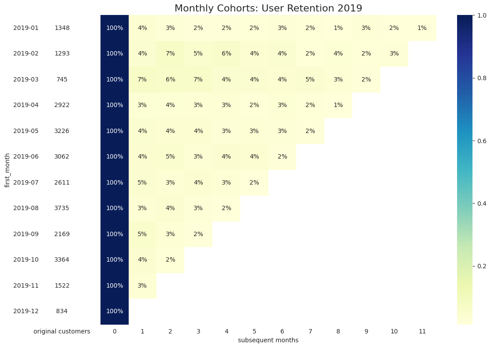

>- **Notes:**
>>- Retention 2019 và 2022 không có nhiều sự thay đổi, do thị trường phim mới hồi phục nên chưa có nhiều thời gian để công ty cải thiện
>>- Lý do retention thấp mặc dù rõ ràng 60-65% traffic có chạy trong năm 2022?

### Compare: Retention of promotion customers & organic customers

```python
# By payment method
df_pie_promo = (
    df_join_all[(df_join_all['status_id'] == 1) & (df_join_all['time'] > '2022-01-01')]
    .groupby('type')
    .agg(total_ticket = ('customer_id','nunique'))
    .sort_values(by='total_ticket', ascending=True)
    .reset_index()
    )
```

```python
df_pie_promo
```

<table border="1" class="dataframe">
  <thead>
    <tr style="text-align: right;">
      <th></th>
      <th>type</th>
      <th>total_ticket</th>
    </tr>
  </thead>
  <tbody>
    <tr>
      <th>0</th>
      <td>non-promotion</td>
      <td>27672</td>
    </tr>
    <tr>
      <th>1</th>
      <td>promotion</td>
      <td>47507</td>
    </tr>
  </tbody>
</table>

```python
# pie
plt.figure(figsize=(6,3))
plt.pie(df_pie_promo['total_ticket'],
        labels= df_pie_promo['type'],
        autopct='%1.0f%%',
        colors=df_pie_promo['type'].replace({'promotion': 'tomato', 'non-promotion': 'lightskyblue'}),
        startangle=90
        )
plt.title('Percentage by type')
plt.show()
```

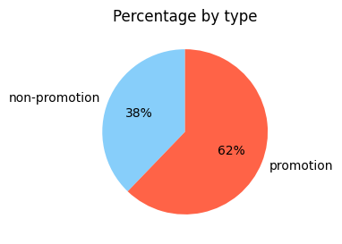

```python
# Phân biệt nhóm đến từ promotion và nhóm organic: dựa trên vé đầu tiên ( first order )
```

```python
# Đánh số thứ tự các ticket của khách hàng:
```

```python
df_data_check = (
    df_join_all[(df_join_all['status_id'] == 1) & (df_join_all['time'] > '2022-01-01')][['customer_id','ticket_id','time','type']]
    .sort_values(by=['customer_id','time'])
)
```

```python
df_data_check.head(10)
```

<table border="1" class="dataframe">
  <thead>
    <tr style="text-align: right;">
      <th></th>
      <th>customer_id</th>
      <th>ticket_id</th>
      <th>time</th>
      <th>type</th>
      <th>row_number</th>
    </tr>
  </thead>
  <tbody>
    <tr>
      <th>66484</th>
      <td>100003</td>
      <td>34c4764b4afa000af4c33a525f20eace</td>
      <td>2022-05-22 12:52:12.105</td>
      <td>non-promotion</td>
      <td>1</td>
    </tr>
    <tr>
      <th>10001</th>
      <td>100004</td>
      <td>1c4aa39842bfc83dbb5856c25a33d9cb</td>
      <td>2022-12-20 06:26:21.373</td>
      <td>non-promotion</td>
      <td>1</td>
    </tr>
    <tr>
      <th>108794</th>
      <td>100007</td>
      <td>5565ba5e22475c7cce298a2bea470428</td>
      <td>2022-03-21 17:57:18.460</td>
      <td>promotion</td>
      <td>1</td>
    </tr>
    <tr>
      <th>0</th>
      <td>100009</td>
      <td>4f5200dcdcf2396b8d50ff84bf423f32</td>
      <td>2022-07-08 17:46:36.145</td>
      <td>promotion</td>
      <td>1</td>
    </tr>
    <tr>
      <th>5585</th>
      <td>100009</td>
      <td>0724203b5146b0ebae6e3678ed7eccde</td>
      <td>2022-12-24 09:32:45.477</td>
      <td>promotion</td>
      <td>2</td>
    </tr>
    <tr>
      <th>69405</th>
      <td>100013</td>
      <td>f95441286dcfa045f61a5760662616e1</td>
      <td>2022-05-05 12:22:44.587</td>
      <td>non-promotion</td>
      <td>1</td>
    </tr>
    <tr>
      <th>140483</th>
      <td>100018</td>
      <td>1e40fb2d0f6264ed3127f79b1a12c9c9</td>
      <td>2022-09-07 21:13:17.896</td>
      <td>non-promotion</td>
      <td>1</td>
    </tr>
    <tr>
      <th>90595</th>
      <td>100018</td>
      <td>9a959ff1649950949ff2c0aff4b62205</td>
      <td>2022-11-19 16:25:43.981</td>
      <td>promotion</td>
      <td>2</td>
    </tr>
    <tr>
      <th>35270</th>
      <td>100020</td>
      <td>af02fc96a6703af7d93162d9f8c61dba</td>
      <td>2022-05-28 19:09:37.936</td>
      <td>promotion</td>
      <td>1</td>
    </tr>
    <tr>
      <th>16649</th>
      <td>100023</td>
      <td>5ed44ff62214268ffcb14d4ea78b04d8</td>
      <td>2022-05-16 08:45:42.397</td>
      <td>promotion</td>
      <td>1</td>
    </tr>
  </tbody>
</table>

```python
# Đánh số thứ tự các ticket của khách hàng:

df_data_check['row_number'] = df_data_check.groupby('customer_id').cumcount() + 1
```

```python
# Số KH có first payment là promotion:
df_data_check[(df_data_check['type'] == 'promotion') & (df_data_check['row_number'] == 1)]['customer_id'].nunique()
```

```console
46189
```

```python
46189/47507
```

```console
0.9722567200623066
```

```python
# Có 97% KH mới đến từ promotion trong nhóm KH có tham gia promotion --> Retention là bao nhiêu?
```

```python
df_first_promo_list = df_data_check[ (df_data_check['type'] == 'promotion') & df_data_check['row_number'] == 1]['customer_id']
df_first_promo_list.drop_duplicates(inplace=True)

df_first_promo_check = pd.merge(df_data_check, df_first_promo_list, on='customer_id', how='inner')
```

```console
/tmp/ipykernel_6155/1669032904.py:2: SettingWithCopyWarning: 
A value is trying to be set on a copy of a slice from a DataFrame

See the caveats in the documentation: https://pandas.pydata.org/pandas-docs/stable/user_guide/indexing.html#returning-a-view-versus-a-copy
  df_first_promo_list.drop_duplicates(inplace=True)

```

```python
(
    df_first_promo_check[ df_first_promo_check['row_number'] == 2 ]['customer_id'].nunique()
/
    df_first_promo_check['customer_id'].nunique()
)

```

```console
0.134793197836067
```

```python
# 13% KH quay lại kể từ lần đầu tham gia promotion ( tỷ lệ chuyển đổi = 13%)
```

